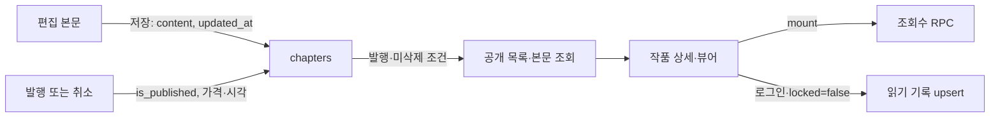

# Graphify 후속 조사 질문

작성일: 2026-09-08

## 목적과 현재 상태

이 문서의 Question은 사용자에게 답변을 요청하는 질문이 아니다. 코드베이스에서 데이터의 시작점, 전달 경로, DB 조회·변경, 권한 검사, 실패 처리를 추적하기 위한 조사 항목이다.

2026-09-08에 Q1–Q7의 소스·SQL·그래프 조사를 수행했다. Q1·Q2, Q3·Q4, Q5는 병렬 에이전트가 조사했고, Q6·Q7 및 최종 문서 통합은 주 에이전트가 담당했다. 아래 질문은 조사 체크리스트로 보존하며, 실제 결론은 뒤의 **조사 결과**에 기록한다. 구현은 변경하지 않았다.

로컬 단위 테스트와 실제 DB 통합 테스트를 구분했다. 외부 Supabase에 사용자·데이터를 생성하고 삭제하는 테스트는 실행하지 않았으므로, SQL에서 확인한 정책 문제를 운영 환경에서 재현한 것으로 해석하면 안 된다. 일부 그래프 생성 이력은 원본 중간 산출물이 없어 복원할 수 없다.

근거는 [그래프 분석 보고서](../graphify-out/GRAPH_REPORT.md), [원시 그래프](../graphify-out/graph.json), 앞선 실제 코드 확인이다. 그래프는 탐색 지도로 사용하고 결론은 최신 소스와 테스트로 확인한다. 계획 문서의 요구사항과 구현된 동작을 구분한다.

## 우선순위

| ID | 우선순위 | 조사 질문 | 상태 |
|---|---|---|---|
| Q1 | 높음 | AI 생성과 지갑 차감은 실패·동시 요청에서 일관성을 유지하는가? | 소스 확인 완료·DB 재현 미실행 |
| Q2 | 높음 | 관리자 권한으로 수행하는 작업의 사용자·소유권 검증은 어디에 있는가? | 소스 확인 완료·세션 재현 미실행 |
| Q3 | 보통 | 작가의 발행 데이터가 독자 화면까지 어떻게 전달되는가? | 소스 확인 완료·브라우저 미검증 |
| Q4 | 높음 | 유료·미발행 챕터 본문은 공개 조회에서 어떻게 보호되는가? | 정책 결함 확인·배포 DB 미검증 |
| Q5 | 보통 | KB 멘션부터 AI 응답과 저장까지 데이터는 어떻게 변환되는가? | 소스·일부 단위 테스트 확인 완료 |
| Q6 | 보통 | 주요 흐름의 실패·권한·동시성 경계를 테스트가 검증하는가? | 검증 범위 조사 완료·통합 테스트 미실행 |
| Q7 | 선행 점검 | 그래프의 약한 연결과 누락은 실제 구조인가, 추출 한계인가? | 현재 산출물 확인 완료·생성 이력 일부 근거 부족 |

## 이미 확인한 기준점: createClient

- 서버용: `lib/supabase/server.ts:4`. 요청 쿠키를 연결한 Supabase 클라이언트를 만든다.
- 브라우저용: `lib/supabase/client.ts:3`. 로그인 화면에서 OAuth를 시작할 때 사용한다.
- 인증 콜백: `app/auth/callback/route.ts:11`. 서버 클라이언트로 코드를 세션으로 교환한다.
- `proxy.ts`는 공통 래퍼 대신 `createServerClient()`를 직접 호출하고 쿠키와 인증 클레임을 처리한다.
- AI 진입점: `app/studio/[workId]/chapters/[chapterId]/actions.ts:97`의 `chatAction()`. `auth.getUser()`로 얻은 사용자 ID와 클라이언트를 `chat()`에 전달한다.
- `lib/ai/chat.ts:90`의 `chat()`은 사용자 클라이언트로 멘션 문서를 조회하고, 별도의 관리자 클라이언트로 지갑을 조회·차감한다.
- 기존 그래프의 서버용 함수 연결 64개는 호출 40개, import 23개, 파일 포함 1개다. 연결 수가 곧 업무 책임의 수를 의미하지 않는다.

줄 번호와 연결 수는 당시 확인한 스냅샷 기준이다. 후속 조사에서 재확인한다.

## Q1. AI 생성과 지갑 차감의 일관성

추적 경로: `chatAction → chat → 잔액 조회 → 출력 한도 계산 → Gemini 응답 → 비용 계산 → apply_wallet_delta`.

확인할 의문점:

- 같은 사용자의 동시 요청이 같은 잔액을 읽었을 때 차감은 원자적으로 처리되는가?
- AI 응답 후 차감이 실패하면 사용자에게 어떤 결과가 반환되고, 재시도는 어떻게 처리되는가?
- 중복 제출·네트워크 재시도 시 생성이나 차감이 중복될 수 있는가? 요청 식별자는 어디서 생성·보존되는가?
- 토큰 계산 단위, 반올림, 잔액 부족 판단이 계산 함수와 DB 함수에서 일치하는가?
- 외부 API 실패·응답 파싱 실패·차감 실패 각각에서 저장되는 데이터는 무엇인가?

시작점: `lib/ai/chat.ts`, `lib/ai/cost.ts`, `lib/ai/gemini.ts`, `supabase/migrations/0001_init.sql`.

검증 후보: `tests/ai/chat.test.ts`, `tests/ai/cost-estimate.test.ts`, `tests/wallet/ledger.concurrency.test.ts`.

완료 기준: 성공·실패·동시 요청별 응답과 지갑 변경을 표로 정리하고, DB 원자성 및 재시도 동작의 근거를 제시한다.

## Q2. 관리자 클라이언트의 권한 경계

추적 경로: 외부 입력 → Server Action 또는 Route Handler → 사용자 확인 → 소유권 확인 → 관리자 DB 작업.

확인할 의문점:

- `createAdminClient()` 호출 지점 전체에서 사용자 ID가 인증 결과로 결정되는가?
- `workId`, `chapterId`, `nodeId`가 현재 사용자에게 속하는지 어디서 확인하는가?
- 하위 함수를 다른 진입점에서 호출해도 동일한 권한 검사가 보장되는가?
- 탈퇴·작가 전환·지갑 변경에서 허용 조건과 실제 DB 변경 범위가 일치하는가?

시작점: `lib/supabase/admin.ts`, `lib/ai/chat.ts`, `app/account/actions.ts`, `lib/auth/account.ts`, `lib/auth/writer.ts`.

완료 기준: 관리자 호출별 입력 출처, 인증·소유권 검사, 변경 테이블, 거부 경로를 대응시킨다. 관리자 권한 사용 자체를 취약점으로 판정하지 않는다.

## Q3. 발행에서 독자 화면까지

추적 경로: 챕터 편집·저장 → 발행 → DB 변경 → 캐시 갱신 → 작품 상세·목록 → 챕터 뷰어 → 읽기 기록.

확인할 의문점:

- 초안 저장과 발행 상태 변경은 어떤 필드를 수정하는가?
- 발행·발행 취소·순서 변경 후 어떤 화면이 갱신되는가?
- 비로그인 독자와 로그인 독자가 받는 데이터는 어떻게 다른가?
- 조회수와 읽기 진행률은 언제 기록되며 중복 접근을 어떻게 처리하는가?

시작점: `lib/chapters/actions.ts`, `lib/works/actions.ts`, `app/works/[workId]/page.tsx`, `app/works/[workId]/chapters/[chapterId]/page.tsx`, `lib/reader/views.ts`, `lib/reader/progress.ts`.

검증 후보: `tests/viewer/chapter-read.test.ts`, `tests/viewer/view-count.test.ts`, `tests/reader/reading-progress.test.ts`.

완료 기준: 필드 변경과 화면 조회 조건을 연결한 흐름도 및 발행 취소 시나리오를 제시한다.

## Q4. 유료·미발행 본문 보호

추적 경로: 공개 요청 → 공개 조회 함수 → DB 정책·선택 컬럼 → 서버 응답 → 뷰어.

확인할 의문점:

- 잠긴 챕터의 본문이 DB 조회, 서버 응답, 클라이언트 전달 중 어느 단계에서 제외되는가?
- 화면에서 숨겨도 응답 데이터에는 본문이 포함되는 경로가 있는가?
- 직접 URL 접근과 다른 사용자의 챕터 ID 전달에도 같은 정책이 적용되는가?
- 구매·잠금 해제는 현재 구현되어 있는가, 계획에만 있는가? 구현된 경우 권한 확인의 기준 데이터는 무엇인가?
- 발행 취소 이후 기존 접근 권한과 본문 조회는 어떻게 달라지는가?

시작점: `lib/chapters/actions.ts`, `app/works/[workId]/chapters/[chapterId]/page.tsx`, `supabase/migrations/0003_reader.sql`.

검증 후보: `tests/viewer/paid-lock.test.ts`, `tests/discovery/public-read-rls.test.ts`.

완료 기준: 비로그인·로그인·소유자·접근 권한 보유 여부별 조회 가능 필드를 정리한다. 미구현 상태는 별도로 표시한다.

## Q5. KB 멘션과 AI 응답의 데이터 변환

추적 경로: 멘션 검색·선택 → 노드 ID 전달 → 문서 조회 → 프롬프트 구성 → 모델 응답 → 파싱 → 초안 또는 KB 제안 저장.

확인할 의문점:

- 검색 결과와 실제 문서 조회에 같은 소유권·작품 범위 조건이 적용되는가?
- 중복·삭제·다른 작품의 노드 ID는 어떻게 처리되는가?
- 스타일, 장르, 프리셋, 이전 본문, 대화 기록은 어떤 순서로 조합되는가?
- 모델 응답에서 일반 답변·챕터 초안·KB 제안을 어떻게 구분하며 잘못된 형식은 어떻게 처리하는가?
- KB 노드 생성 후 내용 저장이 실패하면 어떤 데이터가 남고 재시도는 어떻게 작동하는가?

시작점: `lib/ai/mentions.ts`, `lib/ai/prompt.ts`, `lib/ai/chat.ts`, `app/studio/[workId]/chapters/[chapterId]/actions.ts`, `lib/kb/actions.ts`.

검증 후보: `tests/ai/mention-search.test.ts`, `tests/ai/mention-context.test.ts`, `tests/ai/prompt-composition.test.ts`, `tests/kb/ownership-guard.test.ts`.

완료 기준: 단계별 입력·출력 형태, 범위 필터, 저장 실패 시 상태를 설명한다.

## Q6. 테스트가 실제 흐름을 검증하는가

확인할 의문점:

- Q1–Q5의 성공·실패·권한 거부·동시 요청 경로에 대응하는 테스트가 있는가?
- mock 기반 단위 테스트와 실제 DB·RLS 검증은 각각 어디까지 보장하는가?
- 환경변수가 없어 건너뛰는 테스트와 실제 통과한 테스트를 구분할 수 있는가?
- UI에서 Server Action과 DB까지 연결되는 경로 중 통합 검증이 없는 부분은 어디인가?

시작점: `tests/`, `tests/helpers/db.ts`, `vitest.config.ts`, `package.json`.

완료 기준: 조사 시나리오와 테스트를 대응시켜 검증됨·부분 검증·미검증·실행 불가를 표시한다. `vitest`의 그래프 연결 수를 테스트 커버리지로 해석하지 않는다.

## Q7. 그래프의 신뢰도와 구조적 의문점

기존 생성 결과: 967개 노드, 2,045개 엣지, 114개 커뮤니티. 보고서의 약하게 연결된 심볼 304개는 연결 수가 1 이하인 노드이며 모두 완전히 고립된 것은 아니다.

확인할 의문점:

- 기존 진단의 dangling endpoint 엣지 81개는 어떤 추출 단계에서 발생했는가?
- 무방향 그래프로 병합된 endpoint 관계 16개에서 호출과 포함 관계가 함께 손실되는가?
- `calls`의 표시 방향이 실제 caller → callee와 일치하는가? 기존 출력에서 방향이 뒤집힌 사례가 있었다.
- SQL 파서 미설치로 누락된 마이그레이션 4개를 포함하면 DB 함수·정책 연결이 어떻게 달라지는가?
- 의미 추출 대상 325개 중 캐시 저장이 301개였던 차이는 어떤 파일에서 발생했는가? 파일을 읽었다는 사실과 그래프에 표현되었다는 사실을 구분한다.
- 약하게 연결된 노드가 타입·설정·독립 자산인지, 실제 추출 누락인지 어떻게 분류할 수 있는가?
- `createClient()`처럼 같은 라벨을 가진 함수가 검색에서 혼동되지 않는가?
- 낮은 응집도가 분리를 요구하는 실제 결합 문제인가, import·타입·공통 UI 유틸리티가 섞인 결과인가?
- 생성 이후 코드·계획 변경으로 그래프가 오래된 상태가 되지 않았는가?

시작점: `graphify-out/GRAPH_REPORT.md`, `graphify-out/graph.json`, `graphify-out/cost.json`, 원본 소스 및 마이그레이션.

추가 자동 추천 검토: `lucide-react`, `cn()`이 여러 UI 커뮤니티를 연결하는 것은 공통 UI 의존성일 수 있다. 기능 간 데이터 교환 관계와 구분한다.

완료 기준: 원인별 누락·방향 오류·라벨 혼동을 분류하고, 그래프에서 확인할 수 없는 내용의 범위를 명시한다. 비용 파일의 토큰 0은 실제 무비용이 아니라 당시 위임 사용량 미수집을 의미한다.

## 후속 조사 진행 방식

Q7의 최신성·방향 점검을 먼저 짧게 수행한다. 이후 Q1·Q2, Q3·Q4, Q5를 서로 독립적인 조사 묶음으로 진행할 수 있다. Q6은 각 묶음에서 확인한 시나리오를 모아 종합한다. 동일 파일을 읽는 것은 허용하되, 이 조사 자체는 구현 변경을 요구하지 않는다.

각 항목의 결과는 다음 형식으로 기록한다.

1. 상태: 미조사 / 조사 중 / 확인 완료 / 근거 부족
2. 확인된 흐름: 시작점 → 변환 → 저장 또는 응답
3. 근거: 파일 경로·심볼·당시 줄 번호, 필요한 SQL 정책·함수
4. 검증: 실행한 테스트와 결과, 실행하지 못한 항목과 이유
5. 판정: 정상 동작 / 확인된 문제 / 미구현 / 아직 판단 불가
6. 남은 의문점 및 후속 조치

그래프의 연결만으로 버그·보안 문제·리팩터링 필요성을 확정하지 않는다. 소스와 재현 근거를 함께 기록한다.

---

## 조사 결과 — 2026-09-08

### Q1 결과: 지갑 변경은 원자적, AI 요청 전체는 비원자적

**상태:** 소스 확인 완료, 비용 계산 단위 테스트 통과. DB 동시 요청과 장애 주입은 미실행.

`chatAction`은 인증 ID를 강제한 뒤 `chat`에 전달한다. `chat`은 지갑 조회 → 멘션 조회 → 프롬프트 구성 → 입력 토큰 계산 → 출력 한도 계산 → Gemini 생성 → 실제 사용량 차감 → 응답 파싱 순서로 실행한다. `chat` 자체는 회차·KB·대화 기록을 저장하지 않는다. 대화는 React 상태이며, DB 쓰기는 지갑·원장에 한정된다.

근거: `app/studio/[workId]/chapters/[chapterId]/actions.ts:97`, `lib/ai/chat.ts:90`, `lib/ai/chat.ts:129`, `app/studio/[workId]/chapters/[chapterId]/ai-panel/AiPanel.tsx:76`.

| 시나리오 | 사용자 응답·외부 처리 | 지갑·원장 |
|---|---|---|
| 생성·차감 성공 | reply/draft/proposal 및 remainingBalance 반환 | 원장 1건 + 잔액 감소 |
| 지갑 조회 실패·출력 예산 0 | 생성 전 오류 또는 capped 결과 | 변경 없음 |
| countTokens 실패 | 오류 반환, 생성하지 않음 | 변경 없음 |
| generateContent 예외 | 오류 반환; 제공자 측 실제 처리 여부는 별도 | 차감 없음 |
| 생성 후 DB 차감 실패 | 생성 결과 대신 차감 오류 반환 | 실패한 DB 트랜잭션은 롤백 |
| 차감 커밋 후 응답 유실 | 사용자는 성공 여부를 모를 수 있음 | 이미 차감됐을 수 있으며 조회·복구 경로 없음 |
| 같은 잔액으로 두 생성 시작 | 두 외부 생성 모두 진행 가능. 후속 차감이 부족하면 그 응답은 반환되지 않음 | 행 잠금으로 순차 차감, 음수 잔액 방지 |
| 중복 제출·재시도 | 새 생성 수행 가능 | 매번 새 UUID이므로 추가 차감 가능 |
| 형식 불량 문자열 | 파서가 일반 답변으로 수용하거나 잘못된 제안 제외 | 파싱 전에 이미 차감, 형식 불량 환불 없음 |

`apply_wallet_delta`는 `FOR UPDATE` 후 원장 INSERT와 잔액 UPDATE를 한 함수 호출 안에서 수행한다(`0001_init.sql:43`, `:53`, `:61`). 그러나 외부 Gemini 호출과 이 DB 트랜잭션은 묶여 있지 않다. 사전 잔액 예약도 없다.

**확인된 문제:** 음수 검사가 중복키 검사보다 앞선다(`supabase/migrations/0001_init.sql:48`). 잔액 10에서 참조 X로 -10 성공 후 같은 요청을 반복하면, 중복 판정 전에 `0 - 10 < 0`으로 실패한다. 중복 차감은 막지만 기존 성공을 반환하는 멱등 동작은 보장하지 않는다. 이는 SQL 순서로 확인했으며 DB 재현은 미실행이다. 기존 멱등 테스트는 양수 +20 반복만 검사한다(`tests/wallet/ledger.concurrency.test.ts:57`).

요청 수준에서도 `lib/ai/chat.ts:133`이 매번 `crypto.randomUUID()`를 만든다. UI 메시지 ID는 차감 키로 전달되지 않으며 ‘다시 생성’도 새 호출이다. 따라서 중복 요청·응답 유실을 복구하는 안정적인 요청 ID가 없다.

계산은 `lib/ai/cost.ts:57`에서 예상 입력비용을 빼고 출력 한도를 floor, `:76`에서 실제 입력·출력 비용을 ceil하여 정수 플랫폼 토큰으로 차감한다. SQL은 bigint delta만 적용한다. 예상·실제 입력량이 같고 동시 지출이 없다면 맞물리지만, 동시 요청까지 보장하는 것은 아니다. `gemini.ts:75`의 사용량 누락 시 0 대체도 제공자 청구와의 별도 검증 대상이다. 코드의 모델 가격·환율이 최신인지 외부 자료로 재검증한 조사는 아니다.

후속: 동일 음수 참조 재시도, 마지막 잔액 경쟁, 커밋 후 응답 유실 테스트를 격리 DB에서 추가하고 요청 ID·결과 복구 설계를 검토한다.

### Q2 결과: 인증 ID는 강제되지만 활성 계정·AI 대상 검사가 분산됨

**상태:** 운영 코드 관리자 호출 전수 확인. 실제 세션·HTTP 재현은 미실행.

`createAdminClient()` 운영 호출은 아래 두 곳이다. 생성 함수는 `server-only`와 service-role key를 사용하지만 인증·소유권 검사 자체는 하지 않는다(`lib/supabase/admin.ts:4`).

| 진입점 → 관리자 작업 | ID 출처·검사 | DB 범위·거부 경로 |
|---|---|---|
| `chatAction` → `lib/ai/chat.ts:91` | `getUser()` 후 `{...input, ownerId:user.id}`. work/chapter 소유권·관계, writer·deleted_at 검사 없음 | 자기 wallet 조회 및 ledger 차감. 미로그인·잔액·생성·차감 오류 반환 |
| `app/account/actions.ts:13` → `softDeleteAccount` | 인자 없는 Action이 인증 사용자 ID만 전달 | 자기 profiles의 bio 제거·deleted_at 갱신. DB 오류 throw, 성공 signOut. wallet/ledger 보존 |
| 비교: 작가 전환(관리자 호출 아님) | `app/write/start/actions.ts:7`에서 인증, `lib/auth/writer.ts:18`에서 자기 ID·reader 조건·필명 검증 | profiles role/필명 변경. 길이·중복·기존 writer 거부. deleted_at 조건 없음 |

`chatAction`의 마지막 ownerId 덮어쓰기로 타인 지갑 ID 주입은 막는다(`actions.ts:105`). 멘션도 owner/work 또는 자기 account_template 범위로 제한한다(`lib/ai/mentions.ts:114`). 다만 workId는 멘션 필터, chapterId는 원장 reason에 사용될 뿐, 두 ID의 소유권·존재·상호 관계를 검증하지 않는다(`chat.ts:134`). 임의 작품·챕터 ID를 붙인 요청 거부가 없다는 결론이며, 타인 본문 유출·타인 지갑 차감이 확인됐다는 뜻은 아니다.

다른 편집 함수의 `findOwnedChapter` 및 `getChapterAction` 검사는 chat에 자동 적용되지 않는다. 하위 `chat(client,input)`와 `softDeleteAccount(admin,userId)`는 호출자가 전달한 ID를 신뢰한다. 현재 Action의 안전한 ID 전달과 하위 함수 자체의 보장을 구분해야 한다.

**확인된 공백:** `isAccountActive` 운영 호출은 `app/account/page.tsx:20`이며, `proxy.ts:25`는 claims, `app/studio/layout.tsx:11`은 role만 확인한다. chat·작가 전환 및 profiles RLS도 deleted_at을 확인하지 않는다. soft delete는 모든 기존 JWT의 즉시 폐기를 보장하지 않는다(`lib/auth/account.ts:14`). 남아 있는 유효 인증으로 들어오는 탈퇴 계정을 모든 경로에서 차단한다는 보장은 없다. 실제 탈퇴 세션 재현은 남아 있다.

후속: 활성 계정 검사를 공통 경계에 적용할지 결정하고, AI 대상 작품·회차의 소유권·관계를 검증한다. 관리자 client를 사용하는 단위/통합 테스트만으로 일반 사용자 RLS와 Action 인증이 검증됐다고 판단하지 않는다.

### Q3 결과: 발행·열람 흐름과 기록 무결성

**상태:** 필드·조회·갱신 경로 확인 완료. DB·브라우저 검증 미실행.



| 변경 | 필드·화면 영향 | 근거 |
|---|---|---|
| 본문 저장 | content, updated_at. 발행 본문도 같은 필드 수정 | `lib/chapters/actions.ts:93` |
| 발행 | is_published=true, price_tier, published_at. 본문 저장과 별도 | 같은 파일 `:108` |
| 발행 취소 | is_published=false, unpublished_at. 본문·가격·기존 발행일 보존 | 같은 파일 `:126` |
| 순서 변경 | 소유권 확인 후 order_index 변경 RPC | 같은 파일 `:154`, `0002_studio.sql:133` |
| 캐시 무효화 | 저장은 스튜디오 편집 URL, 발행·취소·순서는 스튜디오 목록 URL | 편집 `actions.ts:34`, `:43`, `:52`; 회차 목록 `actions.ts:12` |
| 공개 조회 | 미삭제 작품, 발행·미삭제 회차를 순서대로 조회 | `lib/works/actions.ts:100`, `lib/chapters/actions.ts:213` |

로그인 여부에 따른 공개 본문 정책 차이는 없고, 로그인 시 구독·북마크·좋아요·이어보기 상태가 추가된다(`app/works/[workId]/page.tsx:27`). 조회수는 로그인·잠금 무관 mount 액션에서 증가하고 사용자별 중복 제거를 하지 않는다(`view-tracker.tsx:9`, `0003_reader.sql:17`). 읽기 기록은 `(user_id,work_id)` 기준 upsert이며 최고 진도를 보존하는 설계가 아니라 마지막 갱신값이 남는다(`lib/reader/progress.ts:7`).

**확인된 문제:**

- 뷰어가 workId·chapterId를 독립 조회하고 존재 여부만 확인한다(`app/works/[workId]/chapters/[chapterId]/page.tsx:15`). 공개 작품 A URL에 B의 공개 회차 ID를 넣으면 A 목차와 B 본문이 결합할 수 있다. 비공개 본문 우회로 단정하지 않는다.
- `trackChapterOpenAction`이 전달받은 locked/workId/chapterId를 재검증하지 않는다(같은 경로 `actions.ts:13`). reading_progress RLS는 자신의 user_id를 검사하지만 작품·회차 FK는 각각 존재만 확인한다(`0003_reader.sql:47`). 자기 기록에 잘못된 작품·회차 조합이나 잠긴 회차를 넣을 수 있는 검증 공백이며 타인 기록 수정과는 다르다.
- 발행 취소 후 progress는 남는다. 작품 상세는 다른 공개 회차가 있으면 기존 progress.chapterId로 이어보기 링크를 만들고, 목록에서 찾지 못하면 라벨을 1화로 계산한다(`app/works/[workId]/page.tsx:75`). 링크는 404, 라벨은 1화가 되는 경로가 있다.

발행 취소 후 새 공개 요청에서는 목록 제외·뷰어 404, 소유자 편집에서는 본문 유지다. 이미 브라우저로 전달한 본문을 회수하지 않는다. 공개 URL에 대한 명시적 revalidate 부재는 확인했지만, 실제 캐시 지연을 재현하지 않았으므로 ‘공개 화면이 계속 오래된 상태’라고 확정하지 않는다.

### Q4 결과: 앱 응답에서 제거하지만 공개 RLS에는 유료 구분이 없음

**상태:** 저장소 정책 결함 확인, 배포 DB grants·직접 REST 조회 재현 미실행.

`getPublicChapter`는 유료 content까지 DB에서 SELECT한 다음 반환 객체에서 null로 바꾼다(`lib/chapters/actions.ts:189`, `:199`). 검토한 정상 뷰어 경로에는 이 제거된 객체가 전달된다. `listPublicChapters`는 처음부터 content를 SELECT하지 않는다(`:219`).

하지만 `chapters_public_read`는 `is_published=true AND deleted_at IS NULL`만 검사한다(`supabase/migrations/0003_reader.sql:9`). 가격·구매권한 조건이나 content 컬럼 별도 제한은 저장소 마이그레이션에 없다. **테이블 SELECT 권한이 있는 배포 구성에서는 anon/authenticated 직접 조회로 유료 본문을 읽을 수 있는 정책 결함이다.** 운영 환경의 실제 권한·응답을 확인했다는 의미는 아니다.

| 사용자 | 공개 무료: 앱 응답 | 공개 유료: 앱 응답 | 미발행: 공개 앱 | 직접 DB 정책 |
|---|---|---|---|---|
| 비로그인 | 본문 | 메타데이터, content=null | 조회 없음 | 발행·미삭제 행은 가격 무관 허용 |
| 로그인 비소유자 | 동일 | 동일 | 조회 없음 | 공개 정책 동일 |
| 소유자 | 동일 | 공개 뷰어에서도 잠김 | 조회 없음 | owner 정책으로 자기 작품 본문 조회·수정 |
| 구매권한 보유자 | 별도 구분 없음 | 사용자별 해금 미구현 | 별도 정책 없음 | 구매권한 데이터·검사 미구현 |

owner 정책은 `0002_studio.sql:90`, 스튜디오 검사는 편집 `actions.ts:13`, `:21`이 근거다. 공개 chapters 정책에는 부모 작품 deleted_at 검사도 없다. 정상 `getPublicWork`의 삭제 검사와 직접 chapters 접근을 구분해야 한다.

구매·언락은 구현되지 않았고 뷰어는 “결제 기능 준비중”이다(`components/reader/viewer-shell.tsx:77`). Phase 6의 영구 소장·unlock 테이블은 계획이다. 발행 취소 시 기존 구매자의 영구 열람권을 어떻게 처리할지도 현재 구현에서 답할 수 없다.

후속: 격리 DB에서 anon/authenticated의 유료 content 직접 조회를 우선 재현하고, 본문 테이블 분리·컬럼 권한·인증된 읽기 함수 등 DB 경계에서 차단하는 방식을 설계한다. 앱에서 null 처리하는 것만으로 완료하지 않는다.

### Q5 결과: 멘션 범위 비대칭·KB 저장 중간 실패

**상태:** 소스 및 파서·프롬프트 단위 테스트 확인. DB 장애 주입·UI 재현 미실행.

| 단계 | 입력 → 출력·변환 | 근거 |
|---|---|---|
| 선택 | 커서 앞 @query 검색 → 트리거 제거 → 멘션 ID 목록. UI에서 동일 ID 추가 방지 | `MentionAutocomplete.tsx:50`, `:74`; 편집 `page.tsx:70` |
| 검색 | 본인 현재 작품 file·카테고리 조건 + 본인 계정 공유 file, 각 최대 20개. 삭제 제외 | `lib/ai/mentions.ts:20`, `:27`, `:43` |
| 본문 조회 | IDs → 본인 현재 작품 및 계정 공유 행 → id/name/category/content. null 본문은 빈 문자열 | 같은 파일 `:114`, `:120`, `:130` |
| 시스템 프롬프트 | baseline → 장르 → 문체 → 지시 프리셋 → 응답 규약 | `lib/ai/prompt.ts:98` |
| 사용자 프롬프트 | KB 원문 → 이전 회차 본문 → 전체 대화 이력 → 마지막 메시지 응답 지시 | 같은 파일 `:152` |
| 응답 | 차감 성공 → REPLY/DRAFT/DOCUMENT 파싱 | `lib/ai/chat.ts:129`, `:138` |
| 초안 반영 | 사용자 삽입으로 로컬 content 변경, 별도 저장 버튼으로 DB 저장 | 편집 `page.tsx:81`, `:48` |
| KB 제안 저장 | 인증 → 폴더 탐색 → 템플릿 포함 노드 INSERT → 제안 본문 UPDATE → 성공 시 멘션 추가 | 편집 `actions.ts:112`, `:117`, `:120`; `AiPanel.tsx:144` |

위 표의 편집 UI 파일은 모두 `app/studio/[workId]/chapters/[chapterId]/` 아래이며, MentionAutocomplete/AiPanel은 `ai-panel/` 아래다.

다른 사용자 노드는 owner_id, 다른 작품 노드는 workId로 제외하며 자기 계정 공유 문서만 추가 허용한다. 삭제·범위 밖 ID는 조용히 제외된다. 정상 DB에서는 작품·계정 공유 scope가 서로 겹치지 않는다(`0002_studio.sql:37`). 반복 ID의 IN 조회가 같은 행을 중복 반환하지는 않지만 서버에서 입력 순서를 복원하지 않으며 작품 결과 다음 공유 결과가 온다. `[[ ]]`는 해석하지 않고 원문으로 넣는다. assistant 초안·제안도 다음 대화 이력에 포함된다(`prompt.ts:131`).

**확인된 문제·제한:**

- 검색에는 file·카테고리 제한이 있으나 실제 본문 조회에는 없다(`mentions.ts:121`). 직접 전달한 본인 소유 폴더·검색 제외 카테고리도 조회 가능하다. 타인 정보 노출이 확인됐다는 뜻은 아니다.
- KB 생성과 본문 UPDATE가 별도다. UPDATE 실패 시 템플릿 노드가 남고 실패 응답에는 그 ID가 없다. 삭제 보상·재저장 복구도 없어 같은 이름 재시도는 sibling unique에 막힐 수 있다(`actions.ts:117`, `:120`; `0002_studio.sql:43`; `lib/kb/actions.ts:171`).
- 프롬프트는 DRAFT/DOCUMENT 동시 포함을 금지하지만 파서는 독립 추출하여 둘 다 반환할 수 있다(`prompt.ts:82`, `chat.ts:30`). REPLY가 없으면 원문을 reply로 사용하고, 잘못된 카테고리·빈 필드의 DOCUMENT는 버린다. 형식 검증 전에 이미 차감된다.
- `sendMessage`·`handleSaveProposal`은 await 뒤에만 로딩 상태를 해제한다(`AiPanel.tsx:91`, `:144`). try/finally가 없어 멘션 DB 조회 throw(`mentions.ts:127`)나 네트워크 예외 때 로딩 상태가 남을 수 있다. `ok:false` 반환 처리와 throw 처리는 별개다.

후속: 생성+본문 저장을 원자화하거나 실패 노드 복구 계약을 정하고, 검색·조회 범위를 맞춘다. 응답 동시 블록과 Action 예외 후 UI 복구 테스트가 필요하다.

### Q6 결과: 로컬 30개 통과, 실제 DB·종단 경계는 별도

**상태:** 테스트 코드·실행 범위 확인 완료. 통과 수는 중복 실행을 제외한 고유 테스트 기준이다.

실행 명령:

```text
node node_modules/vitest/vitest.mjs run tests/ai/prompt-composition.test.ts tests/ai/cost-estimate.test.ts tests/ai/gemini-client.test.ts
```

3파일 24개 통과(프롬프트 13, 비용 7, Gemini mock 4). 비용 파일은 다른 에이전트도 7개 통과했지만 합계에 중복 산입하지 않았다. 실제 Gemini API 호출은 하지 않았다.

파서만 실행한 최초 시도는 `supabaseUrl is required`로 수집 실패, 테스트 0개였다. `chat.test.ts:46`에서 describe 수집 중 adminClient를 생성하기 때문이다. 재시도는 프로세스 환경에 localhost URL·가짜 키만 주고 파서 필터를 실행했다:

```powershell
$env:NEXT_PUBLIC_SUPABASE_URL='http://127.0.0.1:54321'
$env:SUPABASE_SERVICE_ROLE_KEY='local-placeholder-not-a-secret'
node node_modules/vitest/vitest.mjs run tests/ai/chat.test.ts -t parseChatResponse
```

6개 통과, DB 대상 5개는 이름 필터로 제외됐다. DB 테스트·beforeAll은 실행하지 않았다. **합계 30개 통과이며, 이 5개 제외를 환경 부재로 인한 자동 skip이나 통과로 기록하지 않는다.**

| 시나리오 | 기존 테스트·보장 | 이번 판정 |
|---|---|---|
| 비용·프롬프트·기본 파서 | 위 30개 단위 테스트 | 검증됨: 해당 단위 범위 |
| 실제 DB + mock 생성·차감 | `tests/ai/chat.test.ts`의 DB 5개 | 코드 확인, 실행하지 않음 |
| 지갑 원자성 | `ledger.concurrency.test.ts`: 양수 100건 경쟁, 음수 잔액 거부, 양수 동일키, 두 지갑 양수 경쟁 | 코드 확인, DB 실행하지 않음 |
| 음수 동일키·AI 동시 생성·응답 유실 | 해당 경계 테스트 없음 | 미검증 |
| 관리자 Action 인증·탈퇴 JWT | writer/account 테스트는 주로 admin으로 하위 함수 호출 | 부분 검증 설계, 실제 세션 미검증 |
| 공개 유료 응답 | `paid-lock.test.ts`: admin으로 helper 반환값 null 확인 | DB 실행하지 않음; 직접 공개 SELECT 보호는 검증 안 함 |
| 공개 RLS | `public-read-rls.test.ts`: anon id/is_published, 미공개 제외, 조회수 | DB 실행하지 않음; 유료 content 검사 없음 |
| 발행·순서·회차 읽기 | chapters publish/reorder, viewer chapter-read | DB 실행하지 않음 |
| 조회수·읽기 기록 | view-count의 반복 +1/+2, reading-progress의 admin upsert/정렬 | DB 실행하지 않음; URL 관계·발행 취소 후 이어보기 UI 미검증 |
| 멘션 범위·KB 소유권 | mention-search/context, kb ownership-guard | 코드 확인, DB 실행하지 않음 |
| KB 생성 후 UPDATE 실패·재시도 | 저장 Action 통합 테스트 없음 | 미검증 |
| UI → Action → DB 전체 흐름 | 현재 Vitest node 실행으로는 보장 안 됨 | 브라우저 종단 테스트 미실행 |

`tests/helpers/db.ts:16`, `:24`는 실제 Auth 사용자 생성·삭제를 한다. 이번 조사에서는 외부 DB를 변경하는 테스트를 실행하지 않았다. AI/KB DB 테스트에 환경 부재 자동 skip 보호가 없어 수집 실패가 발생할 수 있다. 테스트가 존재한다는 사실과 통과했다는 사실은 다르다.

Vitest는 `environment:'node'`이며 `server-only`를 noop으로 치환한다(`vitest.config.ts:8`, `:23`). 따라서 브라우저 번들 경계·Next.js Action 인증·일반 사용자 RLS까지 검증했다고 볼 수 없다.

### Q7 결과: 그래프의 현재 상태와 복원할 수 없는 이력

**상태:** 현재 JSON·의미 캐시·manifest·설치된 추출기 확인 완료. 이전 원시 추출 중간 결과가 없어 일부 원인 판단은 유보한다.

PATH에 `graphify`가 없어 `graphify-out/.graphify_python`에 기록된 인터프리터로 `-m graphify`를 실행했다. `reflect --if-stale` 결과는 최신 상태, Lessons는 기록 0개였다. 실제 그래프 어휘 기반 `graph extraction client sql`, 각 에이전트의 업무별 query를 먼저 사용한 뒤 소스·SQL을 확인했다.

| 조사 항목 | 이번에 확인한 사실 | 판정·한계 |
|---|---|---|
| 크기·형식 | 967 nodes, 2,045 links, directed=false, multigraph=false | 무방향 단일 그래프. 방향·다중 관계 보존에 한계 |
| 약한 연결 304 | 전체 degree≤1은 344, 완전 고립 degree=0은 27. report의 파일·concept·rationale 제외 필터를 적용하면 304 | 기존 304는 완전 고립 수가 아니라 필터링된 약한 연결 수 |
| 약한 연결 구성 | 전체 344 중 code 168, document 127, concept 38, rationale 6, image 5 | 타입·독립 문서·이미지도 포함. 리팩터링 필요성 지표로 단정 불가 |
| dangling 81 | 최종 JSON 재진단은 dangling 0. 보존된 의미 캐시도 0 | 병합 전 중간 파일이 없어 과거 81개의 발생 단계·대상을 확정 불가. 최종 0이 과거 손실 없음을 뜻하지 않음 |
| 병합 16 | 의미 캐시 290 edges가 무방향 endpoint 283쌍으로 줄어 7개 병합 확인 | 과거 전체 16개는 복원 불가. 의미 캐시에서는 references/역방향 references 또는 conceptually_related_to 병합 확인 |
| calls 방향 | 무방향 query는 탐색 경로 방향으로 읽힐 수 있음. 서버 createClient 인접 관계는 calls 40/imports 23/contains 1 | 표시 화살표를 caller→callee로 해석하지 말고 source_file/source_location의 호출문 확인 |
| SQL 4개 | .sql source_file 노드 0, 설치된 Python에 tree_sitter_sql 없음 | DB 함수·정책 구조가 그래프에 표현되지 않음. SQL 직접 열람 필수 |
| 의미 대상 325 vs 저장 301 | 현 manifest는 md 296 + svg 5, 캐시는 301파일·301 source_file. manifest의 md 누락 없음 | 보존 데이터에서 24개 손실 파일을 특정할 수 없음. 과거 대상 목록이 없어 ‘24개 문서 누락’으로 확정 불가 |
| 동명 createClient | 서버/브라우저가 다른 node ID·파일로 존재. 연결은 서버 64, 브라우저 3 | 라벨만으로 검색 결과 합치지 말고 경로 확인 |
| 최신성 | manifest 해시와 현재 파일을 비교하면 PROJECT.md, REQUIREMENTS.md, ROADMAP.md 변경 | 계획 관련 그래프는 오래된 상태. manifest에 없는 신규 문서까지 최신이라고 보장하지 않음 |
| 비용 0 | cost.json에 input/output 0 | 실제 에이전트 사용량을 수집했다는 증거 없음. 무료 실행 증명으로 사용 불가 |

약한 연결의 대표 예는 MentionAutocompleteProps, TemplateOption, PublicWork, ComputeDebitInput 등 degree=1 타입이다. 이는 포함 관계만 추출된 타입일 수 있다. `lucide-react`나 `cn()`의 공통 의존성도 기능 간 업무 데이터 전달과 구분해야 한다. 낮은 응집도만으로 모듈 분리를 권고하지 않는다.

의미 캐시 병합 예: New Chapter Screen ↔ Chapter List Screen의 references/conceptually_related_to, Chapter Viewer Screen ↔ Public Work Detail Screen의 양방향 references. 현재 증거로 ‘calls와 contains가 함께 유실됐다’고 확정할 수 없다. SQL 파서를 설치·재추출했을 때 추가되는 정책·함수 연결 수 역시 이번에는 측정하지 않았다.

manifest 454개 항목의 종류는 md 296, ts 83, tsx 55, json 7, svg 5, sql 4, mjs 3, cjs 1이다. 과거 보고서의 corpus 480, cost의 files 478, 질문의 의미 대상 325는 동일 모집단이라는 증거가 없다. 숫자 차이만으로 특정 파일 누락을 역산하지 않는다.

후속: 재생성이 필요할 때 원시 AST/의미 추출 및 진단 결과를 보존하고, SQL 파서 지원을 갖춘 뒤 directed·다중 관계 보존 방식을 검토한다. 이번에는 기존 그래프를 재생성하거나 수정하지 않았으며 문서 조사 결과를 최신 소스 근거로 남겼다.

## 후속 조치 우선순위

1. 유료 본문의 anon/authenticated 직접 조회를 격리 DB에서 재현하고 DB 접근 경계를 수정한다.
2. 차감의 음수 재시도·AI 요청 멱등성·응답 유실 복구를 설계하고 실제 경쟁 테스트로 검증한다.
3. 활성 계정·AI 대상 소유권, 뷰어 work/chapter 관계, 읽기 기록 입력 검증을 보완한다.
4. KB 제안 저장의 원자성·재시도 및 UI 예외 복구를 보완한다.
5. 발행 취소 후 이어보기·공개 화면 갱신을 브라우저에서 검증하고, 그래프 생성 이력과 SQL 추출을 보강한다.

이 목록은 조사에서 도출한 후속 작업이며, 이번 문서 수정으로 구현·배포·실DB 검증을 완료한 것은 아니다.
