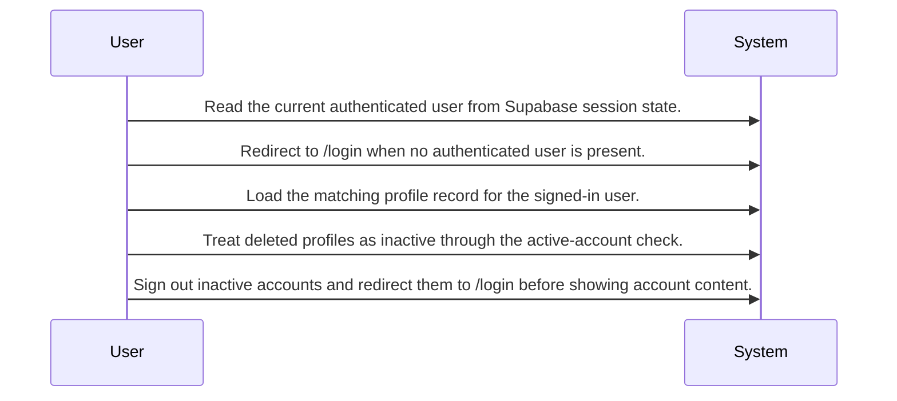
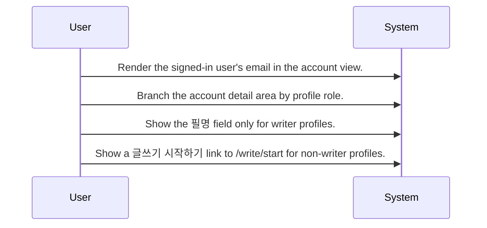
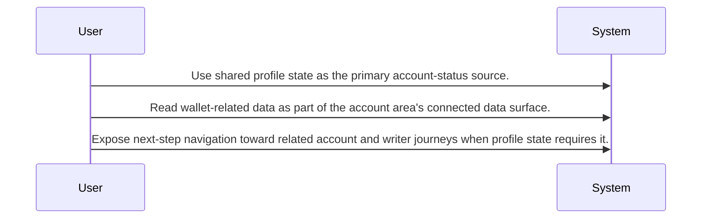

# Account Overview System Design

Routing map for the Account Overview epic centered on the account settings screen, its Supabase-backed identity checks, profile-state branching, and next-action links.

## Primary Flows

### Session And Active Profile Gate

flowKey: account-overview-session-gate

The account screen admits only authenticated users with an active profile and redirects others to /login.

### Profile-Driven Account Summary

flowKey: account-overview-profile-branching

Rendered account details vary by profile role while always exposing the signed-in email.

### Integrated Account Data Surface

flowKey: account-overview-shared-data-surface

The account screen sits on top of shared profile state and wallet reads, with additional connected epic boundaries nearby.

## Routing Hints

- Session And Active Profile Gate: The account settings screen first resolves the current authenticated user from Supabase, then loads the matching profile and blocks access when the session is missing or the profile is inactive. Missing users are redirected to /login, and inactive profiles are signed out before redirecting.; next: Inspect the AccountPage source for the exact redirect and sign-out ordering., Inspect the profile activity rule implementation behind isAccountActive(profile) for inactive-state details.; flowKey: account-overview-session-gate; resolve: `sot resolve --item doc:6gaI-FGwujIbblXVwdHA3#account-overview-session-gate`; sourceRefs: source_document_1
- Profile-Driven Account Summary: When access is allowed, the screen shows the signed-in user's email and branches account details by profile role. Writer profiles show the 필명 field, while non-writer profiles replace that area with a 글쓰기 시작하기 link to /write/start.; next: Inspect the screen implementation for the complete field list and empty-state presentation., Inspect the profile schema and role definitions to confirm which roles are treated as writer profiles.; flowKey: account-overview-profile-branching; resolve: `sot resolve --item doc:6gaI-FGwujIbblXVwdHA3#account-overview-profile-branching`; sourceRefs: source_document_1
- Integrated Account Data Surface: The screen is connected to shared profile data and also reads wallet-related data, making it a coordination point between identity state and account-related resources.; next: Inspect the wallet read path to determine which account decisions depend on wallet state., Inspect connected epics such as Writer Upgrade and Identity Completion to trace cross-screen navigation from the account area.; flowKey: account-overview-shared-data-surface; resolve: `sot resolve --item doc:6gaI-FGwujIbblXVwdHA3#account-overview-shared-data-surface`; sourceRefs: source_document_1

## Evidence Gaps

- The provided context confirms reads from profiles and wallets and an update relation on profiles, but it does not show which account-page action performs the profiles update or its validation rules.
- The provided context does not confirm the requester authorization model beyond reading the current authenticated user and redirecting missing or inactive sessions to /login.
- The provided context does not show the exact UI section that reads wallets, the returned shape of that data, or how wallet information is rendered.
- The provided context does not confirm whether errors from Supabase reads are surfaced to the user, retried, or handled with a fallback state.
- The provided context shows navigation links for profile-dependent next actions, but it does not confirm the complete set of destinations available from the account screen.

## Graph Lookup

- Related APIs, screens, tables, and relation traces are not dumped in this Markdown file.
- Use `sot resolve --document doc:6gaI-FGwujIbblXVwdHA3` for linked specs and graph seeds.
- Use `sot resolve --epic 0oF0HLK2dJTtWk5Y-fQCJ` or catalog `traceId` values with `graph trace` for relation/source paths.
