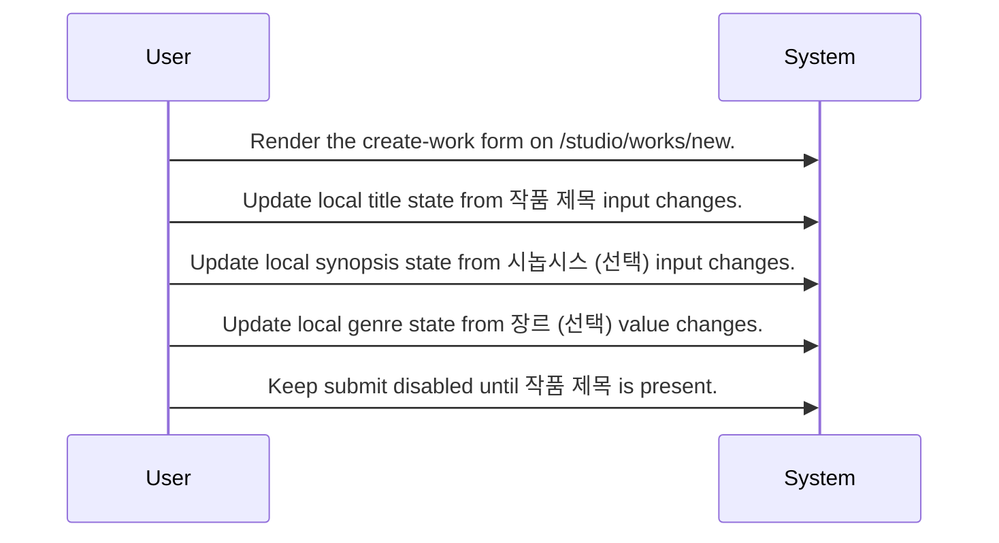
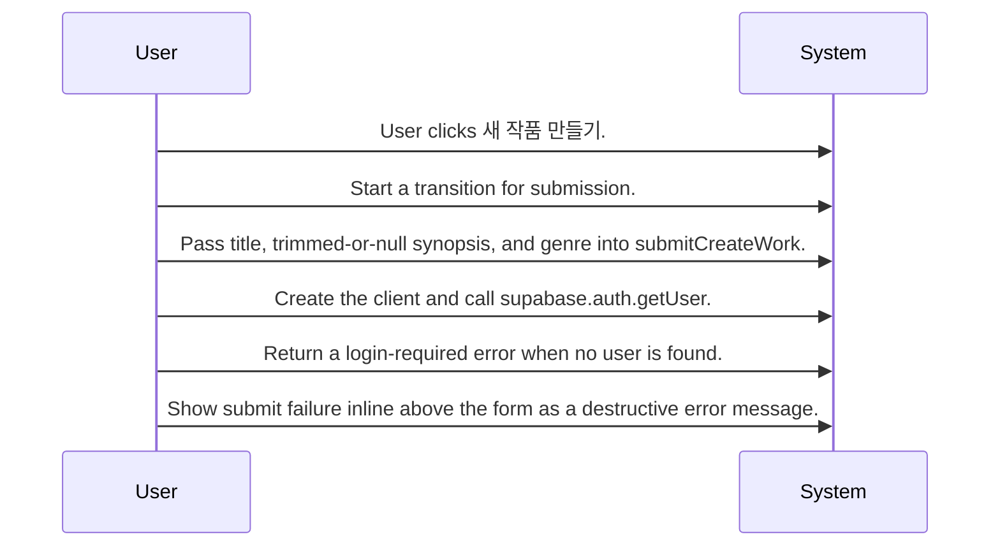
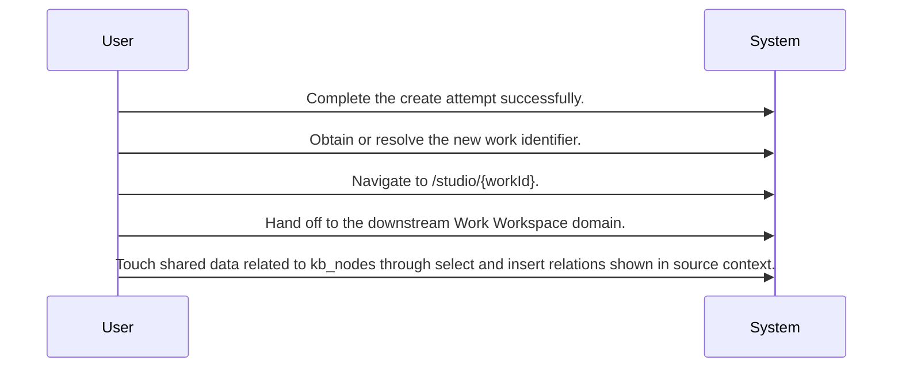

# New Work Creation System Design

Routing map for the New Work Creation epic centered on the create-work screen, its login dependency, its create submission, and its redirect into the created work workspace.

## Primary Flows

### Create-work screen entry point

flowKey: new-work-screen-entry

The create-work journey begins on the dedicated screen with required title capture and optional synopsis and genre.

### Submission and login dependency

flowKey: submit-auth-gate

Submission starts a transition, normalizes optional input, and checks the current user before continuing.

### Success navigation and shared data touchpoints

flowKey: success-redirect-and-data-coupling

A successful create routes into the new work page and appears to touch shared data beyond the screen itself.

## Routing Hints

- Create-work screen entry point: The epic boundary starts at NewWorkPage on /studio/works/new, where the user fills a create-work form with a required title and optional synopsis and genre before submitting.; next: Route to the source screen spec for field behavior and submit gating., Route to the create-work implementation for request handling and persistence details.; flowKey: new-work-screen-entry; resolve: `sot resolve --item doc:KO110lVuI4COxcOMzptqG#new-work-screen-entry`; sourceRefs: source_document_1
- Submission and login dependency: On submit, the screen starts a transition, sends title plus trimmed-or-null synopsis and genre, creates a client, and checks supabase.auth.getUser; when no user is found, it returns a login-required error instead of continuing.; next: Route to the auth integration source for login-required behavior., Route to the create-work handler to confirm what happens after a user is present.; flowKey: submit-auth-gate; resolve: `sot resolve --item doc:KO110lVuI4COxcOMzptqG#submit-auth-gate`; sourceRefs: source_document_1
- Success navigation and shared data touchpoints: Successful creation navigates to /studio/{workId}, linking this epic to the downstream work workspace, while the source context also points to shared-table activity on kb_nodes and an external dependency on supabase_auth:users.; next: Route to the Work Workspace epic for post-creation lifecycle., Route to the lower source for kb_nodes reads and writes if data coupling matters.; flowKey: success-redirect-and-data-coupling; resolve: `sot resolve --item doc:KO110lVuI4COxcOMzptqG#success-redirect-and-data-coupling`; sourceRefs: source_document_1

## Evidence Gaps

- The provided context does not confirm the implementation details, request shape, response shape, or persistence semantics of the create_work write path.
- The provided context does not confirm whether requester authorization beyond checking for a logged-in user is enforced during work creation.
- The provided context does not confirm why kb_nodes is selected and inserted during creation, or whether those operations are part of the same transaction as work creation.
- The provided context does not include the exact validation rules for genre values or any server-side validation behavior.
- The provided context does not confirm the exact inline error text, error taxonomy, or whether failures from authentication and creation are handled differently.

## Graph Lookup

- Related APIs, screens, tables, and relation traces are not dumped in this Markdown file.
- Use `sot resolve --document doc:KO110lVuI4COxcOMzptqG` for linked specs and graph seeds.
- Use `sot resolve --epic 42aB4zT1F3DTaXtt59Vzh` or catalog `traceId` values with `graph trace` for relation/source paths.
