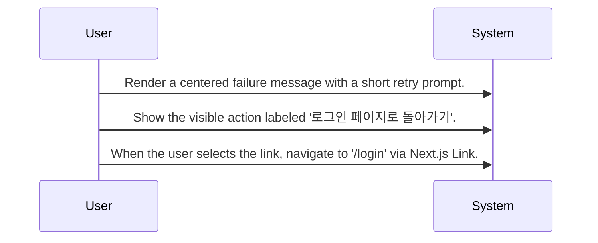

# Login Error Recovery

Routing map for the failed-login recovery screen that shows a static error message and returns the user to the sign-in page.

## Primary Flows

### Failed Login Error Screen

flowKey: login-error-recovery-screen

Static error screen with one navigation action back to the login page.

## Routing Hints

- Failed Login Error Screen: AuthCodeErrorPage is a static recovery screen for interrupted or failed login attempts. It presents a centered failure message and a single visible path back into the sign-in flow through navigation to '/login'.; next: Open the source spec or source code for AuthCodeErrorPage to verify exact copy and layout behavior., Trace the upstream Authentication Callback Handling flow to confirm which failure states land on this screen., Trace the '/login' destination flow to confirm what recovery options are available after navigation.; flowKey: login-error-recovery-screen; resolve: `sot resolve --item doc:xaP6e_RrsQaTvYv1K6SK4#login-error-recovery-screen`; sourceRefs: source_document_1

## Evidence Gaps

- The provided source does not confirm what upstream authentication failure conditions route a user to this screen.
- The provided source does not confirm any authentication, authorization, or session checks before rendering this screen.
- The provided source does not confirm whether telemetry, logging, or retry throttling occurs when the screen is shown or when the link is clicked.
- The provided source does not confirm whether any alternate recovery actions exist beyond navigation back to '/login'.

## Graph Lookup

- Related APIs, screens, tables, and relation traces are not dumped in this Markdown file.
- Use `sot resolve --document doc:xaP6e_RrsQaTvYv1K6SK4` for linked specs and graph seeds.
- Use `sot resolve --epic 4m8kG11em9A1CUTWJcWoz` or catalog `traceId` values with `graph trace` for relation/source paths.
