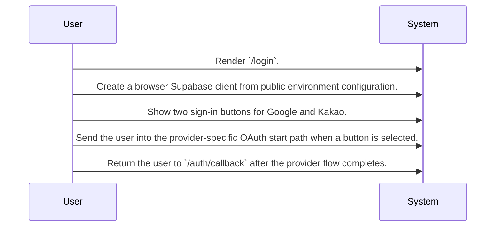
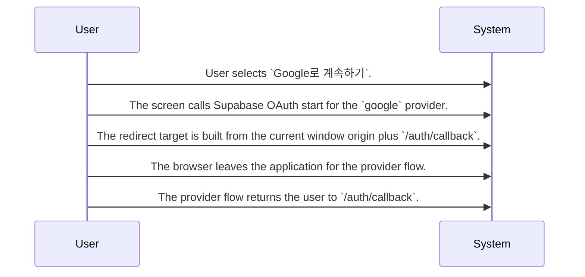
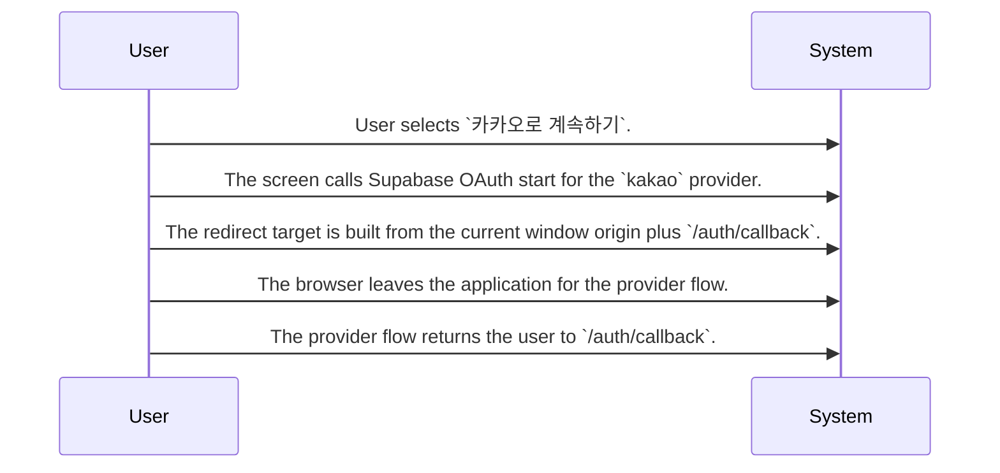

# Social Sign-In

Routing map for the login screen that starts OAuth sign-in with Google or Kakao through Supabase and returns users to the authentication callback route.

## Primary Flows

### Login Screen Entry

flowKey: social-sign-in-login-screen-entry

The login screen exposes two social sign-in choices and routes users into provider-specific OAuth start flows.

### Google OAuth Start

flowKey: social-sign-in-google-oauth-start

The Google button starts a Supabase OAuth flow and routes the user back to the callback path.

### Kakao OAuth Start

flowKey: social-sign-in-kakao-oauth-start

The Kakao button starts a Supabase OAuth flow and routes the user back to the callback path.

## Routing Hints

- Login Screen Entry: The `/login` screen is the entry point for social sign-in and presents exactly two user actions for OAuth sign-in.; next: Google OAuth Start, Kakao OAuth Start; flowKey: social-sign-in-login-screen-entry; resolve: `sot resolve --item doc:ABDjMYJA95ElF6QK2yE6Q#social-sign-in-login-screen-entry`; sourceRefs: source_document_1
- Google OAuth Start: Selecting `Google로 계속하기` starts Supabase OAuth with the `google` provider and uses `/auth/callback` on the current origin as the redirect target after the provider flow.; next: Authentication Callback Handling, external_service:supabase_auth:sessions; flowKey: social-sign-in-google-oauth-start; resolve: `sot resolve --item doc:ABDjMYJA95ElF6QK2yE6Q#social-sign-in-google-oauth-start`; sourceRefs: source_document_1
- Kakao OAuth Start: Selecting `카카오로 계속하기` starts Supabase OAuth with the `kakao` provider and uses `/auth/callback` on the current origin as the redirect target after the provider flow.; next: Authentication Callback Handling, external_service:supabase_auth:sessions; flowKey: social-sign-in-kakao-oauth-start; resolve: `sot resolve --item doc:ABDjMYJA95ElF6QK2yE6Q#social-sign-in-kakao-oauth-start`; sourceRefs: source_document_1

## Evidence Gaps

- The provided source shows how the login screen starts OAuth, but it does not confirm what happens inside the authentication callback after the provider returns the user.
- The provided source does not show any loading, failure, cancellation, or retry behavior for either sign-in action.
- The provided source does not confirm requester authentication or authorization checks on this screen beyond exposing two sign-in buttons.
- The provided source does not confirm whether the sign-in initiation surface reports success or provider errors back to the user.

## Graph Lookup

- Related APIs, screens, tables, and relation traces are not dumped in this Markdown file.
- Use `sot resolve --document doc:ABDjMYJA95ElF6QK2yE6Q` for linked specs and graph seeds.
- Use `sot resolve --epic 8v1lQnJKU9IzItheJ79gQ` or catalog `traceId` values with `graph trace` for relation/source paths.
