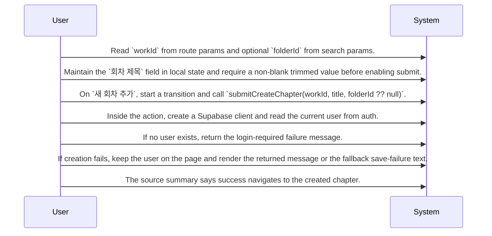

# Chapter Planning and Structure Design

Routing map for creating chapters, listing chapters, and handling chapter order within a work, based on the provided screen-level source cards and relation evidence.

## Primary Flows

### New chapter creation flow

flowKey: chapter-planning-new-chapter

Screen-level route for adding a chapter to the current work.



### Chapter list and reorder flow

flowKey: chapter-planning-list-and-reorder

Screen-level route for browsing chapters, opening a chapter, and attempting order changes.

```mermaid
sequenceDiagram
  participant User
  participant System
  User->>System: Read `workId` from route params.
  User->>System: On mount, create a Supabase client and read the authenticated user.
  User->>System: If a user exists, call `listChapters(supabase, { ownerId: user.id, workId })`; otherwise use an empty chapter list.
  User->>System: If no chapters exist, render the empty state with the `새 회차 추가` link.
  User->>System: If chapters exist, render `ChapterList` with rows ordered by `order_index` ascending and filtered by `work_id` and `deleted_at = null`.
  User->>System: On chapter click, navigate to `/studio/{workId}/chapters/{chapter.id}`.
  User->>System: Show `미발행` when `is_published` is false; otherwise show `{price_tier} 토큰` or `무료` based on the source rule.
  User->>System: Expose drag-and-drop reordering through the grip-handle control.
```

## Routing Hints

- New chapter creation flow: The new chapter screen collects a required chapter title, disables submission while pending or blank after trimming, and routes creation through `submitCreateChapter(workId, title, folderId ?? null)`. The action checks Supabase auth, requires a logged-in user, and the source summary says successful creation navigates to the created chapter while failures stay on the page with an inline error.; next: Open the source behind `submitCreateChapter` to confirm insert behavior, exact return shape, and created chapter navigation contract., Trace the `works`, `kb_nodes`, and `chapters` reads/writes to confirm how ownership and optional folder constraints are enforced.; flowKey: chapter-planning-new-chapter; resolve: `sot resolve --item doc:CJm9M2fm1SFaJ3GFNs1vW#chapter-planning-new-chapter`; sourceRefs: source_document_1
- Chapter list and reorder flow: The chapter list screen reads `workId`, checks the authenticated user on mount, and only queries chapters for authenticated users. It renders either an empty state with the `새 회차 추가` link or a populated `ChapterList`, lets users open `/studio/{workId}/chapters/{chapter.id}`, and exposes drag-and-drop reordering through a grip-handle row control.; next: Inspect the `listChapters` source to confirm exact query shape and any pagination or filtering beyond the cited rules., Follow the reorder implementation to verify whether drag-and-drop writes directly to `chapters`, uses a separate handler, or only updates local state.; flowKey: chapter-planning-list-and-reorder; resolve: `sot resolve --item doc:CJm9M2fm1SFaJ3GFNs1vW#chapter-planning-list-and-reorder`; sourceRefs: source_document_2

## Evidence Gaps

- The exact success payload from `submitCreateChapter` is not fully shown, so the returned data shape beyond success, failure, and navigation to the created chapter is not confirmed.
- The full optional folder validation rule is truncated in the source card, so the precise acceptance criteria for `folderId` are not fully confirmed.
- The persistence path for drag-and-drop reordering is not confirmed because the relation is only shown as `tables:unknown reorder_chapters`.
- Requester authorization rules beyond the observed ownership filter on creation and authenticated query behavior on listing are not fully confirmed from the provided sources.

## Graph Lookup

- Related APIs, screens, tables, and relation traces are not dumped in this Markdown file.
- Use `sot resolve --document doc:CJm9M2fm1SFaJ3GFNs1vW` for linked specs and graph seeds.
- Use `sot resolve --epic BSRh96OQqVVy-mCmDspWk` or catalog `traceId` values with `graph trace` for relation/source paths.
