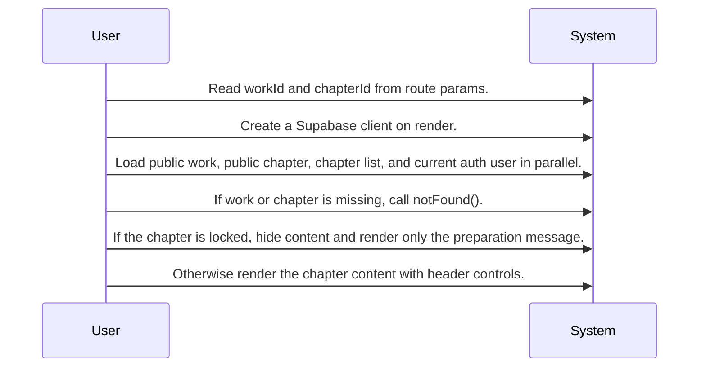
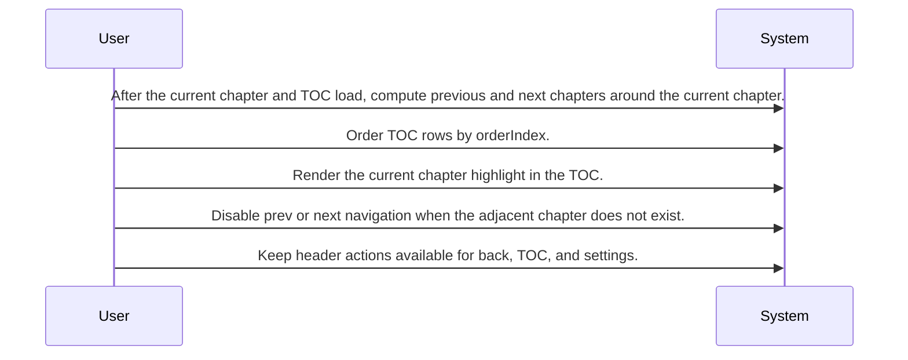
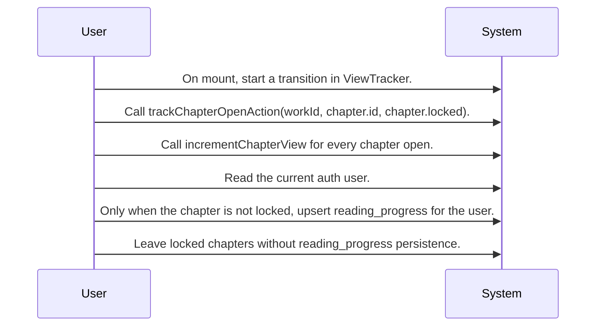

# Chapter Reading Experience System Design

Routing map for the chapter reader screen, covering public chapter loading, locked-state rendering, navigation and TOC behavior, and chapter-open tracking with reading progress writes.

## Primary Flows

### Reader screen load and access-state branching

flowKey: chapter-reader-load-access

Public reader route assembly and rendering decisions for missing or locked chapters.

### Navigation and TOC coordination

flowKey: chapter-reader-navigation-toc

Ordered TOC and adjacent chapter navigation behavior inside the reader.

### Chapter-open tracking and progress persistence

flowKey: chapter-reader-open-tracking

Reader mount flow that records opens and conditionally persists reading progress.

## Routing Hints

- Reader screen load and access-state branching: The /works/:workId/chapters/:chapterId screen loads the public work, current public chapter, chapter list, and current auth user in parallel, then branches to notFound() when the work or chapter is missing, or to a locked-state message when the chapter is locked.; next: ViewerPage lower source spec, Public work and chapter read path, Locked chapter rendering branch; flowKey: chapter-reader-load-access; resolve: `sot resolve --item doc:B2Q2dnAQ87sQuh0H0q3qy#chapter-reader-load-access`; sourceRefs: source_document_1
- Navigation and TOC coordination: The reader computes previous and next chapter targets from the ordered TOC around the current chapter, disables navigation when adjacent chapters do not exist, and keeps the current chapter highlighted in the TOC.; next: ViewerPage TOC behavior, Chapter ordering source, Adjacent chapter navigation branch; flowKey: chapter-reader-navigation-toc; resolve: `sot resolve --item doc:B2Q2dnAQ87sQuh0H0q3qy#chapter-reader-navigation-toc`; sourceRefs: source_document_1
- Chapter-open tracking and progress persistence: On mount, ViewTracker starts a transition that calls trackChapterOpenAction(workId, chapter.id, chapter.locked); that flow always calls incrementChapterView and only upserts reading_progress after reading the auth user when the chapter is not locked.; next: trackChapterOpenAction lower source spec, reading_progress write path, Reading Progress Tracking epic; flowKey: chapter-reader-open-tracking; resolve: `sot resolve --item doc:B2Q2dnAQ87sQuh0H0q3qy#chapter-reader-open-tracking`; sourceRefs: source_document_1

## Evidence Gaps

- The provided source does not confirm any requester authorization rules beyond reading the current auth user during chapter-open tracking.
- The implementation details, return shape, and failure handling of incrementChapterView are not shown in the provided context.
- The provided source mentions settings actions, but it does not show whether viewing preferences are persisted or only handled in local UI state.
- The relations show reports table activity, but the provided source summary does not confirm the exact user flow, validation rules, or response behavior for report creation or lookup from this screen.

## Graph Lookup

- Related APIs, screens, tables, and relation traces are not dumped in this Markdown file.
- Use `sot resolve --document doc:B2Q2dnAQ87sQuh0H0q3qy` for linked specs and graph seeds.
- Use `sot resolve --epic DwVdypyCp2wh37VaxYHTU` or catalog `traceId` values with `graph trace` for relation/source paths.
