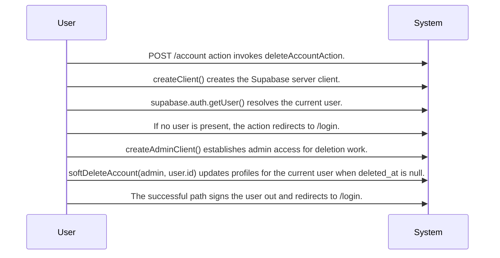

# System Design: Account Closure

Routing map for the account-closure flow grounded in the observed POST /account delete action: require a current user, soft-delete the profile record, then sign out and redirect to /login.

## Primary Flows

### Authenticated account closure action

flowKey: account-closure-post-account-delete

POST /account resolves the current user, soft-deletes the profile through admin access, then signs out and redirects to /login.

## Routing Hints

- Authenticated account closure action: The account-closure boundary is a POST /account action that first resolves the current Supabase user, redirects unauthenticated requests to /login, then performs profile soft-delete work through admin access before signing the user out and redirecting to /login.; next: Inspect source_document_1 for the exact action flow and redirect sequence., Trace softDeleteAccount to confirm what fields are changed in profiles and whether any related cleanup exists., Inspect Supabase auth integration sources if downstream agents need session invalidation or user-state details.; flowKey: account-closure-post-account-delete; resolve: `sot resolve --item doc:uNW29bLb7mDn2uATzLpsX#account-closure-post-account-delete`; sourceRefs: source_document_1

## Evidence Gaps

- The provided source does not confirm the user-facing request payload, form shape, or screen behavior that triggers account closure.
- The provided source does not confirm the exact response body because the observed success path ends with redirect('/login') after sign-out.
- The provided source does not confirm whether any related records beyond profiles are cleared, anonymized, or deleted during account closure.
- The provided source does not confirm error handling behavior for failures in softDeleteAccount, admin client creation, or sign-out.

## Graph Lookup

- Related APIs, screens, tables, and relation traces are not dumped in this Markdown file.
- Use `sot resolve --document doc:uNW29bLb7mDn2uATzLpsX` for linked specs and graph seeds.
- Use `sot resolve --epic HoBO4rJLao81zsp1RnCM7` or catalog `traceId` values with `graph trace` for relation/source paths.
