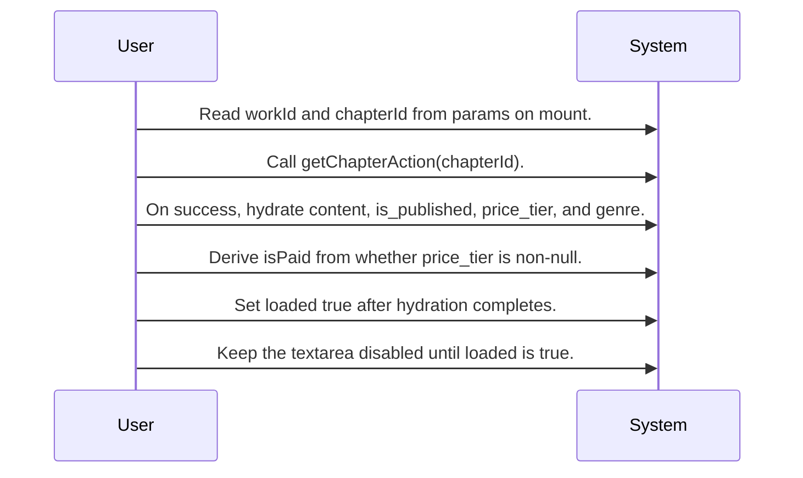
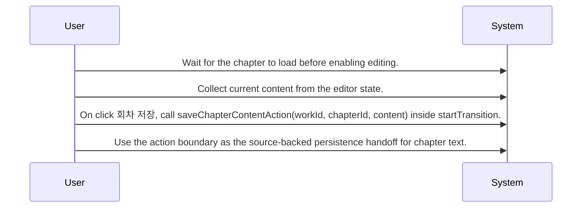
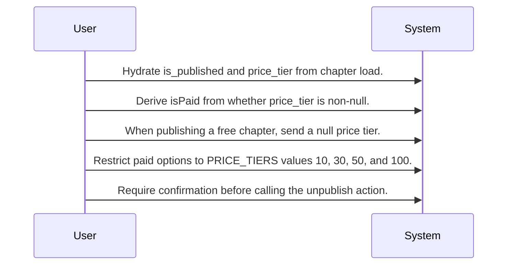
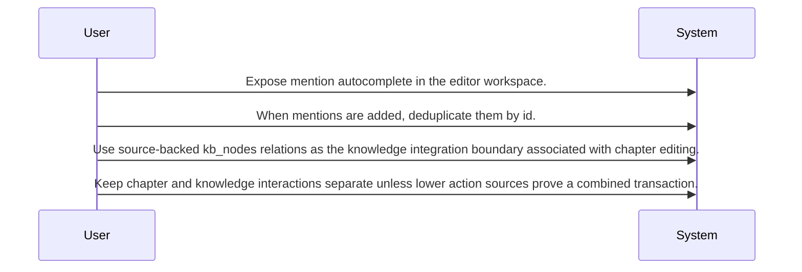

# System Design Routing Map for Chapter Editing and Publishing

This design centers on a chapter editor screen that loads chapter state, allows writers to save draft content, supports publish and unpublish actions with price-tier rules, and connects editing activity to knowledge-base mention management.

## Primary Flows

### Chapter load and draft editing workspace

flowKey: chapter-editor-load-and-edit

Route-driven chapter loading hydrates the editor and gates editing until load completion.

### Draft save path

flowKey: chapter-editor-save

The save control persists current editor content through the screen action boundary.

### Publish, unpublish, and monetization state

flowKey: chapter-publish-and-price-tier

Publishing behavior is governed by fixed price tiers, free/null pricing, and an explicit unpublish confirmation step.

### Mention and knowledge-base integration

flowKey: chapter-mentions-kb-nodes

Mentions feed a knowledge-management boundary with deduplication and kb_nodes reads and writes.

## Routing Hints

- Chapter load and draft editing workspace: The screen at /studio/:workId/chapters/:chapterId reads route params, loads chapter data through getChapterAction(chapterId), hydrates content and publishing fields, and keeps the text editor disabled until loading completes.; next: ChapterEditorPage screen spec, getChapterAction source, chapters table model; flowKey: chapter-editor-load-and-edit; resolve: `sot resolve --item doc:cNF6H1C31J20oLP_D-Tpx#chapter-editor-load-and-edit`; sourceRefs: source_document_1
- Draft save path: The 회차 저장 action sends workId, chapterId, and current content through saveChapterContentAction inside startTransition, making the screen the routing point for draft persistence from the editor workspace.; next: saveChapterContentAction source, chapters write path, transition/loading UI behavior; flowKey: chapter-editor-save; resolve: `sot resolve --item doc:cNF6H1C31J20oLP_D-Tpx#chapter-editor-save`; sourceRefs: source_document_1
- Publish, unpublish, and monetization state: Publishing uses the current chapter state with price-tier rules: PRICE_TIERS is limited to 10, 30, 50, and 100, free publishing uses a null price tier, and unpublish requires a confirmation dialog before its action call.; next: publishChapterAction source, unpublishChapterAction source, chapter monetization rules; flowKey: chapter-publish-and-price-tier; resolve: `sot resolve --item doc:cNF6H1C31J20oLP_D-Tpx#chapter-publish-and-price-tier`; sourceRefs: source_document_1
- Mention and knowledge-base integration: The editor supports mention autocomplete and deduplicates mentions by id when added, with source-backed relations showing both reads and writes against kb_nodes alongside chapter updates.; next: mention autocomplete source, kb_nodes integration source, knowledge sync rules; flowKey: chapter-mentions-kb-nodes; resolve: `sot resolve --item doc:cNF6H1C31J20oLP_D-Tpx#chapter-mentions-kb-nodes`; sourceRefs: source_document_1

## Evidence Gaps

- The provided source does not confirm requester authentication or authorization checks for loading, saving, publishing, or unpublishing a chapter.
- The provided source does not confirm the exact response shapes returned by getChapterAction, saveChapterContentAction, publishChapterAction, or unpublishChapterAction.
- The provided source does not show a source-backed recovery path, retry path, or error presentation after chapter load failure or missing chapter.
- The provided source summary mentions AI assistant actions to generate, regenerate, reject, and save proposals, but the concrete handler flow and persistence behavior for those actions are not fully shown in the provided evidence.
- The cross-epic topology shows shared tables such as works and wallets, but the provided source card does not confirm direct screen-level reads or writes against those tables within this flow.

## Graph Lookup

- Related APIs, screens, tables, and relation traces are not dumped in this Markdown file.
- Use `sot resolve --document doc:cNF6H1C31J20oLP_D-Tpx` for linked specs and graph seeds.
- Use `sot resolve --epic KWzV2pFYljuCDXE3S4ruY` or catalog `traceId` values with `graph trace` for relation/source paths.
