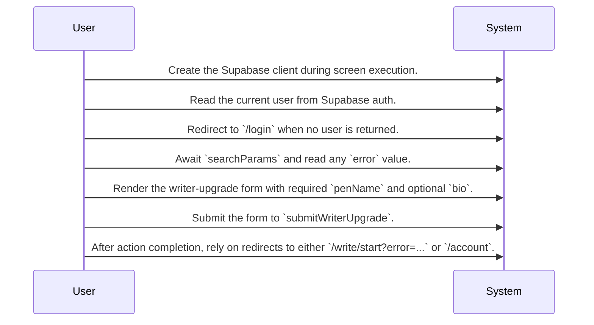
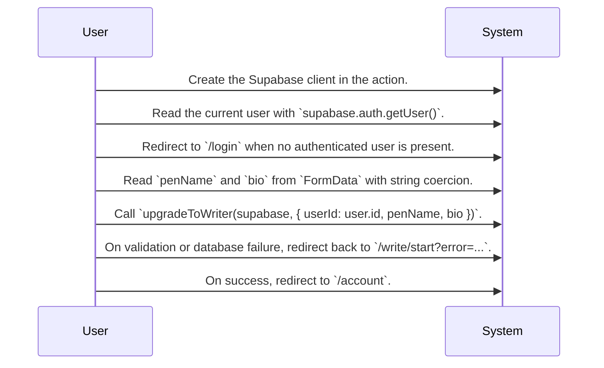
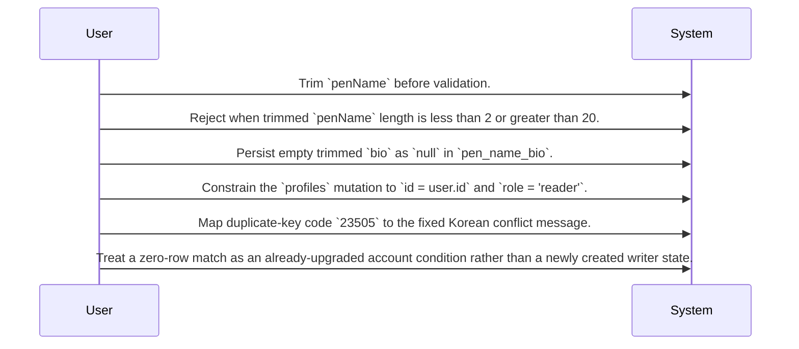

# Writer Upgrade System Design

Routing map for the reader-to-writer upgrade flow centered on the Write Start screen and the submitWriterUpgrade action.

## Primary Flows

### Write Start entry screen

flowKey: writer-upgrade-write-start-screen

User-facing writer onboarding entry point with authentication gate, form rendering, error display, and handoff to the upgrade action.

### submitWriterUpgrade action

flowKey: writer-upgrade-submit-action

Authenticated form action that normalizes input, checks the user, and dispatches the writer upgrade mutation.

### Writer profile mutation rules

flowKey: writer-upgrade-profile-mutation-rules

Observed business and persistence rules for turning a reader profile into a writer profile.

## Routing Hints

- Write Start entry screen: The Write Start screen is the user-facing entry point for writer onboarding. It checks the current Supabase user, redirects unauthenticated visitors to `/login`, renders the form, and shows any error returned through the query string before submission to the upgrade action.; next: submitWriterUpgrade action, Account Overview epic; flowKey: writer-upgrade-write-start-screen; resolve: `sot resolve --item doc:kw8aOEYQN9s3dkJWS_urF#writer-upgrade-write-start-screen`; sourceRefs: source_document_2
- submitWriterUpgrade action: The form action behind `POST /write/start` reads `penName` and `bio` from `FormData`, gets the current Supabase user, redirects unauthenticated requests to `/login`, and calls `upgradeToWriter(supabase, { userId, penName, bio })` to perform the account-role transition.; next: profiles table update, Account Overview epic; flowKey: writer-upgrade-submit-action; resolve: `sot resolve --item doc:kw8aOEYQN9s3dkJWS_urF#writer-upgrade-submit-action`; sourceRefs: source_document_1
- Writer profile mutation rules: The upgrade logic is implemented as a constrained `profiles` update for the signed-in user. It trims `penName`, requires a 2 to 20 character length, stores `pen_name_bio` as `null` when the trimmed bio is empty, maps duplicate-key error `23505` to a fixed Korean pen-name conflict message, and treats no matched row as an already-upgraded account.; next: profiles table, Source spec for `upgradeToWriter`; flowKey: writer-upgrade-profile-mutation-rules; resolve: `sot resolve --item doc:kw8aOEYQN9s3dkJWS_urF#writer-upgrade-profile-mutation-rules`; sourceRefs: source_document_1, source_document_2

## Evidence Gaps

- The provided sources do not confirm how `wallets` data is used on the Write Start screen, even though a `tables:select wallets` relation is listed.
- The provided sources do not show the exact success payload or persisted record returned by `upgradeToWriter`; they only confirm redirect outcomes at the screen and action level.
- The provided sources do not confirm any requester authorization beyond checking the signed-in user and constraining the `profiles` update to `id = user.id` and `role = 'reader'`.

## Graph Lookup

- Related APIs, screens, tables, and relation traces are not dumped in this Markdown file.
- Use `sot resolve --document doc:kw8aOEYQN9s3dkJWS_urF` for linked specs and graph seeds.
- Use `sot resolve --epic TPGBVklZxbIBligTLR7ZA` or catalog `traceId` values with `graph trace` for relation/source paths.
