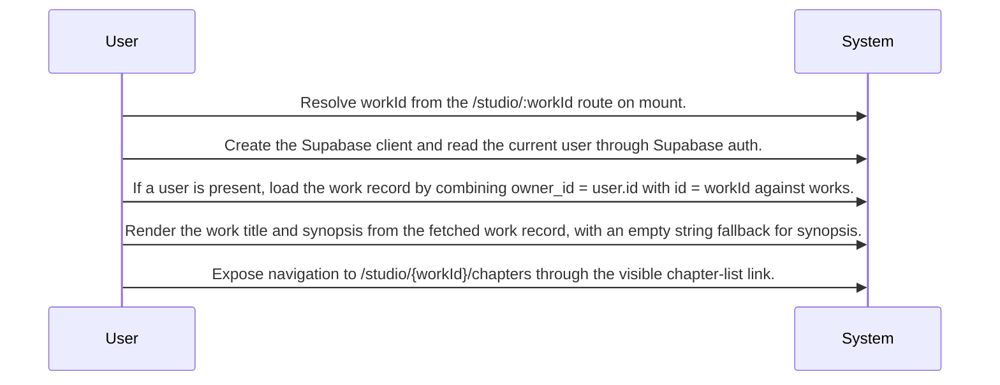

# Work Workspace System Design

Routing map for the Work Workspace landing page that loads a user-scoped work record and links writers into chapter work.

## Primary Flows

### Work detail landing page

flowKey: work-workspace-home

User-scoped work home screen for reviewing core work details and moving into chapter tasks.

## Routing Hints

- Work detail landing page: The Work Workspace epic is anchored by a screen at /studio/:workId that reads the route workId, gets the current Supabase user, fetches a matching work from works using both owner_id and id, renders the work title and synopsis, and offers navigation to /studio/{workId}/chapters.; next: Chapter Planning and Structure, New Work Creation; flowKey: work-workspace-home; resolve: `sot resolve --item doc:mhCLGOHHFHIVlSs_iMpUc#work-workspace-home`; sourceRefs: source_document_1

## Evidence Gaps

- The provided source does not confirm how the screen behaves when no authenticated user is present beyond skipping the user-scoped work query.
- The provided source does not confirm whether missing or unauthorized work access shows an error state, redirect, or empty page.
- The provided source does not confirm any server-side authorization boundary beyond the client-side use of the current Supabase user and the query filter on owner_id and id.
- The provided source does not confirm loading indicators, retry behavior, caching behavior, or analytics/event emission for this screen.

## Graph Lookup

- Related APIs, screens, tables, and relation traces are not dumped in this Markdown file.
- Use `sot resolve --document doc:mhCLGOHHFHIVlSs_iMpUc` for linked specs and graph seeds.
- Use `sot resolve --epic _Pnwofz1Iq27Y-rvAkG7q` or catalog `traceId` values with `graph trace` for relation/source paths.
