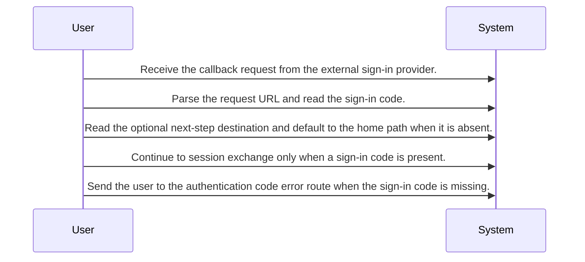
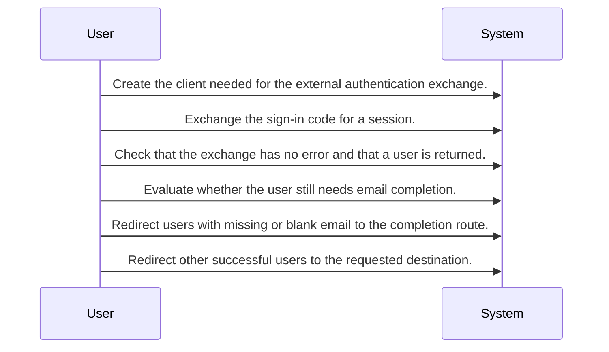
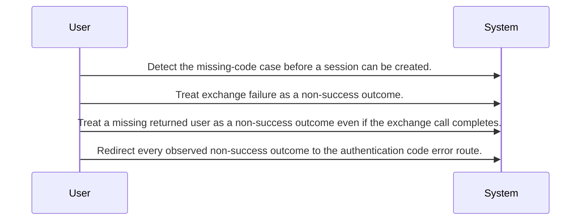

# System Design Draft - Authentication Callback Handling

Agent routing map for the authentication callback flow that exchanges an external sign-in code for a session and routes the user to completion, destination, or error paths.

## Primary Flows

### Authentication callback entry

flowKey: auth-callback-entry

Reads callback inputs and determines whether the sign-in flow can proceed.

### Session creation and destination routing

flowKey: auth-callback-success-routing

Exchanges the sign-in code for a session and chooses the downstream success route.

### Failure fallback

flowKey: auth-callback-failure-fallback

Collapses all observed non-success outcomes into a single error route.

## Routing Hints

- Authentication callback entry: The callback handler reads the sign-in code and optional next-step destination from the request URL, then decides whether it can continue the sign-in flow.; next: Session exchange with Supabase, Authentication code error route; flowKey: auth-callback-entry; resolve: `sot resolve --item doc:ZX5KTh90ZHx_G76MSAmu2#auth-callback-entry`; sourceRefs: source_document_1
- Session creation and destination routing: When the external code exchange succeeds and a user record is returned, the flow creates the session context and routes either to email completion or to the requested next step.; next: Identity Completion, Requested post-login destination; flowKey: auth-callback-success-routing; resolve: `sot resolve --item doc:ZX5KTh90ZHx_G76MSAmu2#auth-callback-success-routing`; sourceRefs: source_document_1
- Failure fallback: If the sign-in code is missing, the exchange fails, or no user is returned, the handler sends the user to the authentication code error path.; next: Login Error Recovery; flowKey: auth-callback-failure-fallback; resolve: `sot resolve --item doc:ZX5KTh90ZHx_G76MSAmu2#auth-callback-failure-fallback`; sourceRefs: source_document_1

## Evidence Gaps

- The source does not confirm whether the return destination is restricted to trusted internal paths before redirecting the user.
- The source does not confirm any requester authentication or authorization checks at this callback boundary beyond the external code exchange outcome.
- The source does not describe the response body or status details because every observed branch redirects the user to another page.
- The source does not confirm retry behavior, timeout handling, or observability around the external session exchange.

## Graph Lookup

- Related APIs, screens, tables, and relation traces are not dumped in this Markdown file.
- Use `sot resolve --document doc:ZX5KTh90ZHx_G76MSAmu2` for linked specs and graph seeds.
- Use `sot resolve --epic ddmjKqZQPK1w1e5HiSfvy` or catalog `traceId` values with `graph trace` for relation/source paths.
