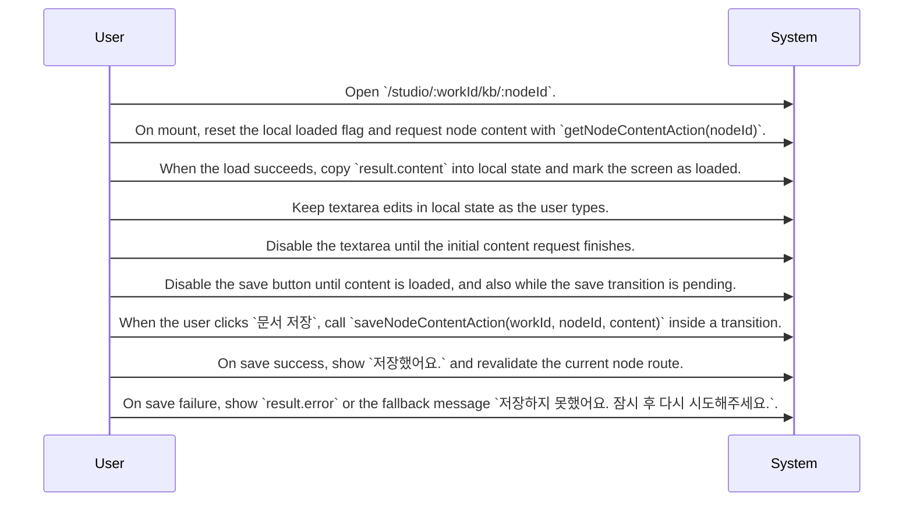

# Story Knowledge Management System Design

Routing map for the knowledge-base node editor screen that loads and saves node content through Supabase-backed actions and updates the current node route after a successful save.

## Primary Flows

### Knowledge-Base Node Editing Screen

flowKey: story-knowledge-management-kb-node-editor

Screen-level design for loading, editing, and saving a knowledge-base node document.

## Routing Hints

- Knowledge-Base Node Editing Screen: The editor at `/studio/:workId/kb/:nodeId` loads one node document on mount, keeps edited text in local state, and saves the updated content through Supabase-backed actions tied to `nodeId` and `owner_id`. After a successful save, the current node route is revalidated and the user sees a success toast.; next: Inspect the source for `getNodeContentAction(nodeId)` to confirm load-time errors, response shape, and any access checks., Inspect the source for `saveNodeContentAction(workId, nodeId, content)` to confirm persistence rules, failure cases, and the exact save response., Inspect the connected source spec or code for `kb_nodes` to confirm stored fields beyond the editable content body.; flowKey: story-knowledge-management-kb-node-editor; resolve: `sot resolve --item doc:0K_lD5vdH2XYY_KQYm2uU#story-knowledge-management-kb-node-editor`; sourceRefs: source_document_1

## Evidence Gaps

- The provided evidence does not confirm what authentication or requester authorization checks are enforced before a user can open or save this editor screen.
- The provided evidence does not show the exact request and response shapes for the load and save actions beyond the visible fields used by the screen.
- The cross-epic connection mentions external_service:supabase_auth:users, but the screen-level role of that dependency is not directly shown in the provided source card.

## Graph Lookup

- Related APIs, screens, tables, and relation traces are not dumped in this Markdown file.
- Use `sot resolve --document doc:0K_lD5vdH2XYY_KQYm2uU` for linked specs and graph seeds.
- Use `sot resolve --epic eJ5obXr2iXGhdipaJzFza` or catalog `traceId` values with `graph trace` for relation/source paths.
