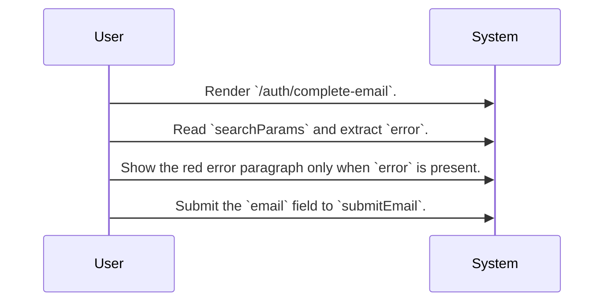
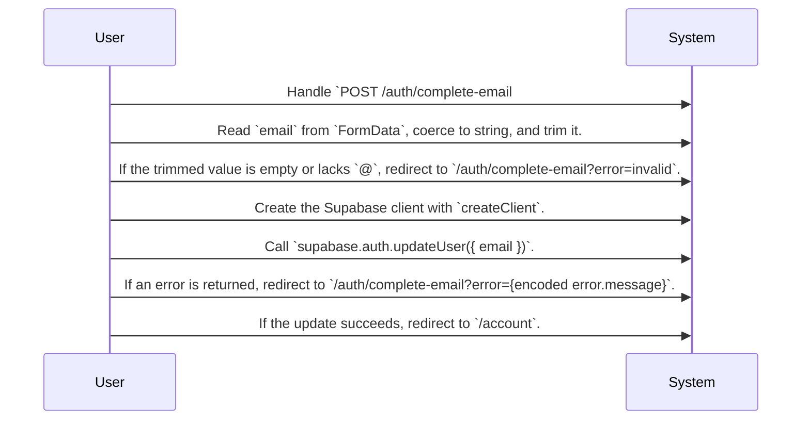

# System Design Routing Map for Identity Completion

Identity Completion routes a signed-in user with missing email data to a dedicated completion screen, validates a basic email format in the submit action, updates the user email through Supabase Auth, and then redirects either back to the screen with an error or onward to `/account`.

## Primary Flows

### Email completion screen

flowKey: identity-completion-screen

Dedicated fallback screen for collecting a missing email address and surfacing route-provided errors.

### Email submission and auth update

flowKey: identity-completion-submit-email

Server action validates a basic email shape, updates the user email through Supabase Auth, and redirects on both success and failure paths.

## Routing Hints

- Email completion screen: `/auth/complete-email` is a focused fallback screen that reads a route-provided error, shows a single email form, and forwards submission to `submitEmail` for validation and account update.; next: Route UX or copy questions to the source screen spec behind `CompleteEmailPage`., Route rendering or query-param behavior questions to the source screen implementation for `/auth/complete-email`., Route submit-path questions to the paired action source `source_document_1`.; flowKey: identity-completion-screen; resolve: `sot resolve --item doc:vW6_yr7bEzzmUbAG_uaZF#identity-completion-screen`; sourceRefs: source_document_2
- Email submission and auth update: `POST /auth/complete-email#action:submitEmail` trims the submitted email, rejects empty or non-`@` values by redirecting back with `error=invalid`, then uses `createClient` and `supabase.auth.updateUser({ email })`; failures redirect back with the encoded provider error and success redirects to `/account`.; next: Route exact mutation semantics and redirect behavior to the `submitEmail` action source., Route external identity-provider questions to the Supabase Auth integration represented by `supabase.auth.updateUser({ email })`., Route downstream post-success behavior to the connected Account Overview epic instead of inferring it here.; flowKey: identity-completion-submit-email; resolve: `sot resolve --item doc:vW6_yr7bEzzmUbAG_uaZF#identity-completion-submit-email`; sourceRefs: source_document_1, source_document_2

## Evidence Gaps

- The provided sources do not confirm how a user is detected as having incomplete identity data before reaching `/auth/complete-email`.
- The provided sources do not confirm requester-side authentication or authorization guards for viewing `/auth/complete-email` or invoking `submitEmail`.
- The provided sources do not confirm whether any validation beyond trimming and checking for `@` is enforced by the server action or by Supabase.
- The provided sources do not confirm the internal behavior of `createClient` or any session, token, or tenancy behavior behind the Supabase client setup.
- The provided sources do not confirm whether the success path returns any updated user payload before redirecting to `/account`.
- The provided sources do not confirm any retry, rate limit, or duplicate-submission protection for repeated email update attempts.
- The provided sources do not confirm how the downstream `/account` experience uses the completed email after the redirect.

## Graph Lookup

- Related APIs, screens, tables, and relation traces are not dumped in this Markdown file.
- Use `sot resolve --document doc:vW6_yr7bEzzmUbAG_uaZF` for linked specs and graph seeds.
- Use `sot resolve --epic j2LecR7weVGaqetE2Y2R0` or catalog `traceId` values with `graph trace` for relation/source paths.
