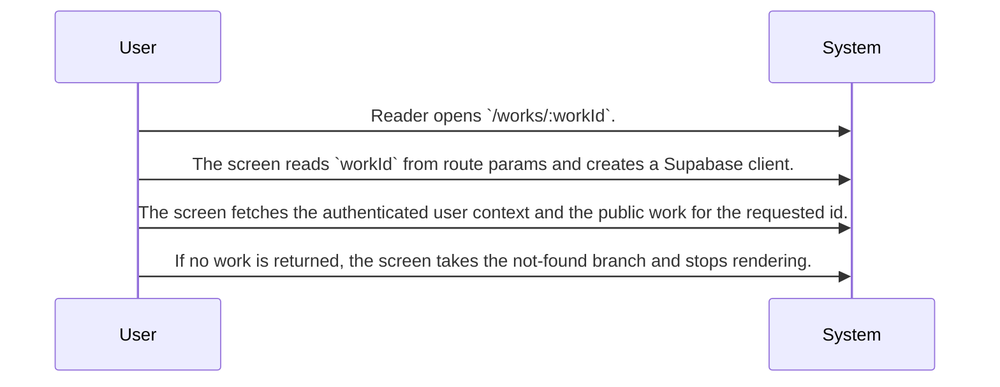
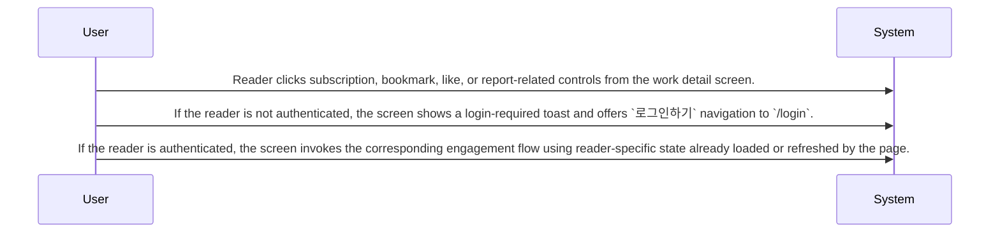
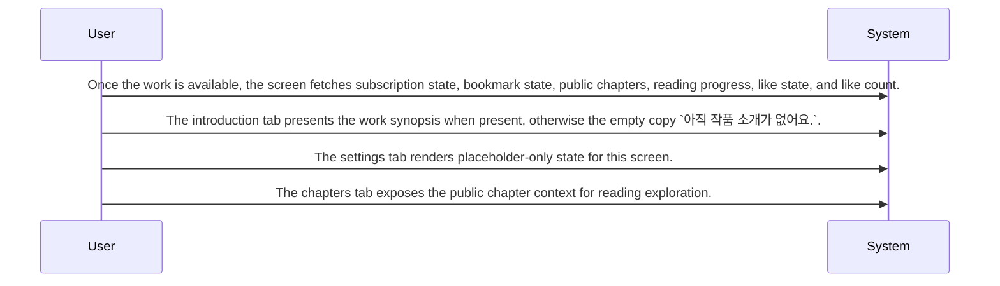

# System Design Draft for Work Detail and Engagement

Routing map for the work detail experience covering page entry, authenticated engagement actions, and tabbed reading context on WorkDetailPage.

## Primary Flows

### Work detail page entry and existence gate

flowKey: work-detail-entry-gate

Screen entry resolves the work and ends in a not-found branch when the target work is missing.

### Authenticated engagement actions

flowKey: work-detail-engagement-actions

Reader engagement is exposed on the page, with login gating for unauthenticated users.

### Tabbed reading context and post-load enrichment

flowKey: work-detail-tabs-and-enrichment

The screen adds reader-specific and chapter context after the work loads and presents fixed tabs.

## Routing Hints

- Work detail page entry and existence gate: WorkDetailPage is the screen boundary for `/works/:workId`. It reads the route work identifier, fetches the authenticated user and the public work, and stops rendering with a not-found branch when the work is unavailable.; next: Open the source spec for WorkDetailPage when downstream work depends on route entry behavior or missing-work handling., Route data-contract questions about the public work payload to the connected source spec and source code.; flowKey: work-detail-entry-gate; resolve: `sot resolve --item doc:lKNF6XGqFSnsILJXxU2KV#work-detail-entry-gate`; sourceRefs: source_document_1
- Authenticated engagement actions: The page exposes reader engagement actions through header controls and report entry points. When the reader is not logged in, engagement attempts show a login-required toast with a `로그인하기` action to `/login`; when logged in, the page triggers bookmark, subscription, like, and report-related flows tied to reader state.; next: Use the connected lower source for exact write behavior of like, bookmark, subscription, and report handlers., Check the engagement source before assuming returned success payloads, emitted events, or transaction guarantees.; flowKey: work-detail-engagement-actions; resolve: `sot resolve --item doc:lKNF6XGqFSnsILJXxU2KV#work-detail-engagement-actions`; sourceRefs: source_document_1
- Tabbed reading context and post-load enrichment: After the public work loads, the page enriches the screen with subscription state, bookmark state, public chapters, reading progress, like state, and like count. The visible tabs are fixed to `소개`, `작품설정`, and `회차`; the introduction tab shows synopsis or empty copy, and the settings tab remains a placeholder for this screen.; next: Route chapter-list and reading-progress questions to the connected lower source that defines those reads., Use the source implementation when exact loading order, empty states, or failure handling matters.; flowKey: work-detail-tabs-and-enrichment; resolve: `sot resolve --item doc:lKNF6XGqFSnsILJXxU2KV#work-detail-tabs-and-enrichment`; sourceRefs: source_document_1

## Evidence Gaps

- The source shows authenticated-user checks for like, bookmark, subscription, and report entry, but it does not confirm deeper requester authorization rules beyond login gating.
- The source shows the settings tab as a placeholder state, so no settings data contract, edit flow, or persistence behavior is confirmed for this variant.
- The source references report interaction and several post-load reads, but the exact request and response shapes, write results, and error branches are not fully described in the provided evidence.

## Graph Lookup

- Related APIs, screens, tables, and relation traces are not dumped in this Markdown file.
- Use `sot resolve --document doc:lKNF6XGqFSnsILJXxU2KV` for linked specs and graph seeds.
- Use `sot resolve --epic sX2ROfqNfCIDxIsGLpv7-` or catalog `traceId` values with `graph trace` for relation/source paths.
