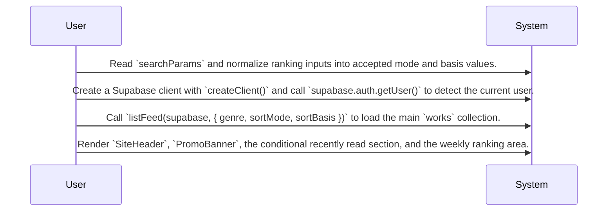
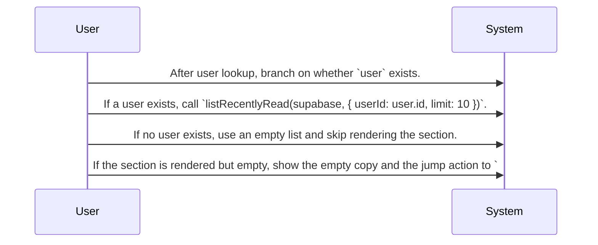
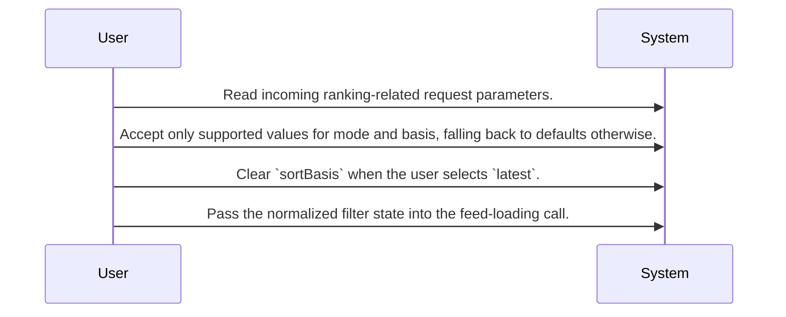
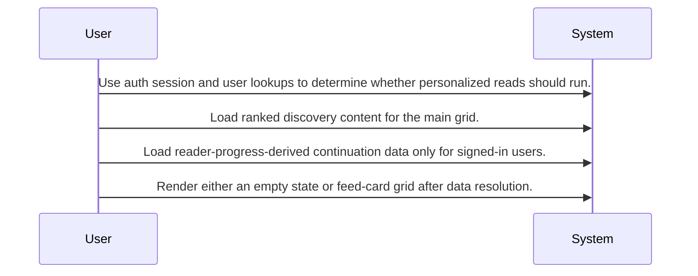

# Home Discovery System Design

Routing map for the home discovery screen that assembles ranking, optional continuation cues, and filter-driven feed loading from Supabase-backed reads.

## Primary Flows

### Home screen composition and initial load

flowKey: home-discovery-screen-composition

The root route assembles discovery content from parsed filters, auth state, and feed data.

### Signed-in continuation path

flowKey: home-discovery-signed-in-continuation

Recently read content is only loaded and shown for signed-in users.

### Ranking filter interaction boundary

flowKey: home-discovery-ranking-filters

The ranking UI normalizes filter inputs and applies a reset rule for latest mode.

### Data and integration footprint

flowKey: home-discovery-data-footprint

The home page acts as a read-side orchestrator across auth and shared discovery-related tables.

## Routing Hints

- Home screen composition and initial load: Route `/` builds the discovery landing screen by deriving ranking filters from `searchParams`, checking the current user with Supabase auth, loading the feed, and then rendering the header, promo banner, optional continuation section, and ranking content.; next: Inspect the connected HomePage source when changing initial render order or filter parsing., Route feed-loading behavior changes to the source behind `listFeed(...)` rather than assuming screen-only logic.; flowKey: home-discovery-screen-composition; resolve: `sot resolve --item doc:Vyi8cwoT218Gdx6rekjZ4#home-discovery-screen-composition`; sourceRefs: source_document_1
- Signed-in continuation path: Personalized continuation cues are gated by the presence of a current user. When a user exists, the screen loads up to 10 recently read items; otherwise it uses an empty list and does not render the continuation section.; next: Use the recently-read loader implementation for changes to limits, ordering, or item semantics., Use Reading Progress Tracking sources for lifecycle details behind continuation data.; flowKey: home-discovery-signed-in-continuation; resolve: `sot resolve --item doc:Vyi8cwoT218Gdx6rekjZ4#home-discovery-signed-in-continuation`; sourceRefs: source_document_1
- Ranking filter interaction boundary: The home ranking area supports genre plus ranking mode and basis selection, with defaults applied in the UI and a special reset rule where selecting `latest` clears `sortBasis`.; next: Inspect the ranking source path before changing filter persistence or URL conventions., Validate downstream analytics or ranking services before changing basis options.; flowKey: home-discovery-ranking-filters; resolve: `sot resolve --item doc:Vyi8cwoT218Gdx6rekjZ4#home-discovery-ranking-filters`; sourceRefs: source_document_1
- Data and integration footprint: The screen is a read-oriented orchestration layer that relies on Supabase auth plus shared-table reads connected to profiles, works, reading_progress, work_likes, and wallets.; next: Route schema or query changes to the lower source documents that own Supabase access and table usage., Review cross-epic dependencies before assuming this screen owns progression or engagement state.; flowKey: home-discovery-data-footprint; resolve: `sot resolve --item doc:Vyi8cwoT218Gdx6rekjZ4#home-discovery-data-footprint`; sourceRefs: source_document_1

## Evidence Gaps

- The exact response shape returned by the feed-loading path is not shown in the provided evidence, so downstream work should confirm what `listFeed(...)` returns beyond a list used as `works`.
- The provided evidence shows a signed-in check through `supabase.auth.getUser()`, but it does not confirm any broader requester authorization rules for home data access.
- The internal query logic, ranking formulas, and table-by-table joins inside the feed and recently-read loaders are not fully shown in the provided evidence.
- The source shows a cross-epic link to Reading Progress Tracking, but the trigger and navigation behavior into that epic are not described in the provided evidence.
- The connection summary shows navigation gaps, so downstream agents should verify route transitions and linked destinations before assuming complete home-screen navigation coverage.

## Graph Lookup

- Related APIs, screens, tables, and relation traces are not dumped in this Markdown file.
- Use `sot resolve --document doc:Vyi8cwoT218Gdx6rekjZ4` for linked specs and graph seeds.
- Use `sot resolve --epic y10ONYsPUsuqDchl5bB47` or catalog `traceId` values with `graph trace` for relation/source paths.
