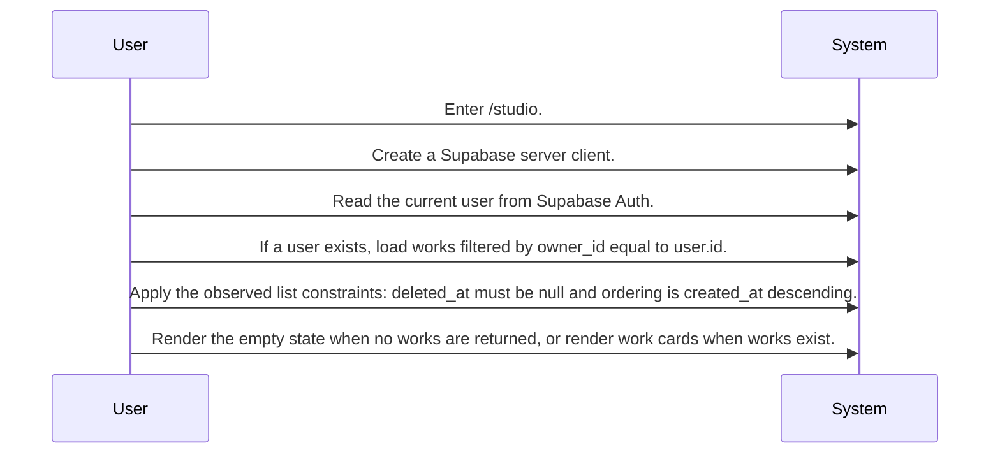
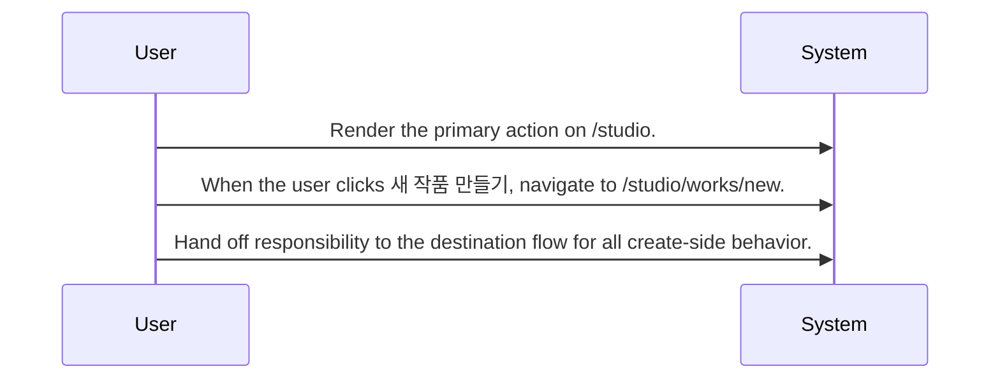

# Work Portfolio Management System Design

Routing map for the /studio work list screen that reads the current Supabase user, loads that user's works from works, and routes creation to /studio/works/new.

## Primary Flows

### Work list screen loads the current user's portfolio

flowKey: work-list-screen

The /studio screen reads the current user, queries works for that owner, and switches between empty-state and list rendering.

### Primary creation action routes writers to the new-work entry point

flowKey: new-work-navigation

The /studio screen exposes a create action that navigates to /studio/works/new.

## Routing Hints

- Work list screen loads the current user's portfolio: The /studio screen creates a Supabase server client on mount, reads the current user, and loads works for owner_id equal to that user's id. The screen then renders either an empty state or a list ordered by most recent created_at, excluding rows with deleted_at set.; next: Open source_document_1 for the exact screen flow and list rendering branches., Follow the cross-screen dependency to New Work Creation for what happens after creation is started., Inspect the connected source spec and code before assuming any backend authorization beyond the observed owner_id filter.; flowKey: work-list-screen; resolve: `sot resolve --item doc:XU8swzafiGblhtrICDG4m#work-list-screen`; sourceRefs: source_document_1
- Primary creation action routes writers to the new-work entry point: From the same /studio screen, clicking 새 작품 만들기 navigates the user to /studio/works/new.; next: Use source_document_1 for the screen entry point and action label., Follow the outgoing epic link to New Work Creation for creation-specific behavior., Inspect the destination source before assuming validation, draft initialization, or saved-record responses.; flowKey: new-work-navigation; resolve: `sot resolve --item doc:XU8swzafiGblhtrICDG4m#new-work-navigation`; sourceRefs: source_document_1

## Evidence Gaps

- The provided evidence only covers the /studio screen, so the behavior of the destination screens and any downstream create or detail flows is not confirmed here.
- The evidence shows screen-side filtering by the current user's id, but it does not confirm any separate requester authorization or database policy enforcement beyond that observed flow.
- The unauthenticated path is only shown as works being set to an empty list, so redirect behavior, access restrictions, and user messaging for signed-out visitors are not confirmed.

## Graph Lookup

- Related APIs, screens, tables, and relation traces are not dumped in this Markdown file.
- Use `sot resolve --document doc:XU8swzafiGblhtrICDG4m` for linked specs and graph seeds.
- Use `sot resolve --epic yzFrm9l4_RMevijWnGVDf` or catalog `traceId` values with `graph trace` for relation/source paths.
